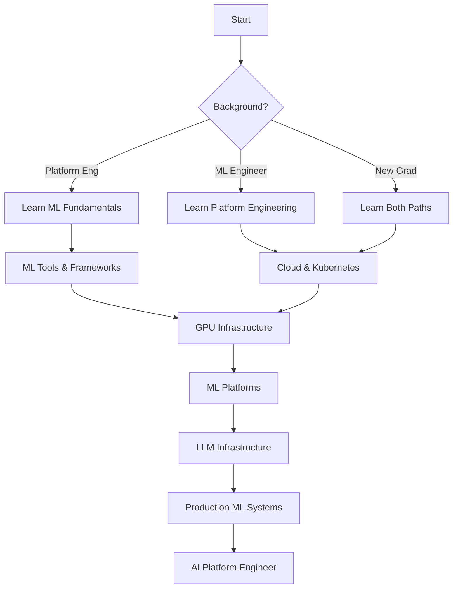

# AI Platform Engineering Roadmap

A comprehensive learning path to transition into AI/ML platform engineering, whether you're coming from traditional platform engineering, ML engineering, or starting fresh.

## Overview

AI Platform Engineering sits at the intersection of:
- **Platform Engineering**: Building developer platforms
- **Machine Learning**: Understanding ML workflows  
- **Distributed Systems**: Scaling AI workloads
- **Cloud Infrastructure**: Managing expensive compute



## Learning Paths by Background

### Path 1: From Platform Engineering to AI

**Timeline: 4-6 months**

#### Month 1: ML Fundamentals
**Week 1-2: Machine Learning Basics**
- [ ] Complete [Andrew Ng's ML Course](https://www.coursera.org/learn/machine-learning) (Basics only)
- [ ] Understand training vs inference
- [ ] Learn about model types (supervised, unsupervised, reinforcement)
- [ ] Practice with scikit-learn tutorials

**Week 3-4: Deep Learning Essentials**
- [ ] [Fast.ai Practical Deep Learning](https://course.fast.ai/) - Part 1
- [ ] Understand neural networks, CNNs, RNNs, Transformers
- [ ] Learn PyTorch or TensorFlow basics
- [ ] Run models on Google Colab with GPUs

**Resources:**
- 📚 [Deep Learning Book](https://www.deeplearning.org/the-deep-learning-textbook/) - Chapters 1-5
- 🎥 [3Blue1Brown Neural Network Series](https://www.youtube.com/playlist?list=PLZHQObOWTQDNU6R1_67000Dx_ZCJB-3pi)
- 🔧 [PyTorch Tutorials](https://pytorch.org/tutorials/)

#### Month 2: GPU Computing & Infrastructure
**Week 1-2: GPU Fundamentals**
- [ ] Learn CUDA basics and GPU architecture
- [ ] Understand GPU memory management
- [ ] Practice with `nvidia-smi` and GPU monitoring
- [ ] Deploy a model on a cloud GPU instance

**Week 3-4: Distributed Training**
- [ ] Learn data parallelism vs model parallelism
- [ ] Practice with Horovod or PyTorch Distributed
- [ ] Understand gradient accumulation and synchronization
- [ ] Implement a simple distributed training job

**Hands-On Project:**
```python
# Build a distributed training setup
# 1. Set up multi-GPU training locally or on cloud
# 2. Implement data parallel training
# 3. Add checkpointing and recovery
# 4. Monitor GPU utilization and optimize
```

**Resources:**
- 📖 [NVIDIA Deep Learning Examples](https://github.com/NVIDIA/DeepLearningExamples)
- 🎥 [GPU Programming Course](https://www.youtube.com/watch?v=n6x_6Lqg9HU)
- 📚 [Programming Massively Parallel Processors](https://www.elsevier.com/books/programming-massively-parallel-processors/kirk/978-0-12-811986-0)

#### Month 3-4: ML Platforms & Tools
**Week 1-2: MLOps Tools**
- [ ] Learn MLflow for experiment tracking
- [ ] Practice with Weights & Biases
- [ ] Understand model versioning and registry
- [ ] Implement CI/CD for ML

**Week 3-4: Kubernetes for ML**
- [ ] Deploy Kubeflow on a cluster
- [ ] Create custom operators for ML workloads
- [ ] Implement GPU scheduling and sharing
- [ ] Build a model serving pipeline

**Week 5-6: Production ML Systems**
- [ ] Learn feature stores (Feast, Tecton)
- [ ] Implement model monitoring
- [ ] Practice A/B testing for models
- [ ] Build end-to-end ML pipeline

**Capstone Project:**
Build a complete ML platform that includes:
- Data ingestion and preprocessing
- Distributed training orchestration
- Model registry and versioning
- Automated deployment and serving
- Monitoring and alerting

### Path 2: From ML Engineering to Platform

**Timeline: 3-4 months**

#### Month 1: Platform Engineering Fundamentals
**Week 1-2: Linux & Systems**
- [ ] Master Linux system administration
- [ ] Learn shell scripting and automation
- [ ] Understand networking basics
- [ ] Practice system debugging

**Week 3-4: Containers & Orchestration**
- [ ] Deep dive into Docker
- [ ] Learn Kubernetes fundamentals
- [ ] Deploy applications on K8s
- [ ] Understand service mesh concepts

**Resources:**
- 📚 [Kubernetes Up and Running](https://www.oreilly.com/library/view/kubernetes-up-and/9781492046523/)
- 🎮 [KillerCoda Kubernetes](https://killercoda.com/kubernetes)
- 📖 [Linux Journey](https://linuxjourney.com/)

#### Month 2: Cloud & Infrastructure as Code
**Week 1-2: Cloud Platforms**
- [ ] Get AWS/GCP/Azure certification
- [ ] Learn cloud networking and security
- [ ] Practice with managed services
- [ ] Understand cost optimization

**Week 3-4: IaC and GitOps**
- [ ] Master Terraform for infrastructure
- [ ] Learn Helm for Kubernetes packages
- [ ] Implement GitOps with ArgoCD
- [ ] Build reproducible environments

**Hands-On Project:**
Deploy a complete ML platform using IaC:
```hcl
# Terraform configuration for ML platform
module "ml_platform" {
  source = "./modules/ml-platform"
  
  gpu_node_pools = {
    training = {
      machine_type = "n1-highmem-8"
      accelerator_type = "nvidia-tesla-v100"
      accelerator_count = 2
      node_count = 3
    }
  }
  
  enable_features = {
    kubeflow = true
    mlflow = true
    prometheus = true
  }
}
```

#### Month 3: SRE & Production Operations
**Week 1-2: Monitoring & Observability**
- [ ] Set up Prometheus and Grafana
- [ ] Implement distributed tracing
- [ ] Create SLOs for ML services
- [ ] Build alerting rules

**Week 3-4: Reliability Engineering**
- [ ] Learn chaos engineering principles
- [ ] Implement circuit breakers
- [ ] Practice incident response
- [ ] Build runbooks for ML systems

### Path 3: Fresh Graduate Path

**Timeline: 6-8 months**

#### Phase 1: Foundations (Month 1-2)
**Parallel Learning Approach:**
- Morning: Platform engineering basics
- Afternoon: ML fundamentals
- Evening: Hands-on projects

**Week 1-4: Core Skills**
- [ ] Python programming proficiency
- [ ] Linux command line mastery
- [ ] Basic ML algorithms
- [ ] Container basics

**Week 5-8: Applied Learning**
- [ ] Deploy ML models in containers
- [ ] Basic Kubernetes operations
- [ ] Simple neural networks
- [ ] Cloud platform basics

#### Phase 2: Specialization (Month 3-5)
Choose a focus area and deep dive:

**Option A: Infrastructure Focus**
- Advanced Kubernetes
- GPU cluster management
- Performance optimization
- Cost management

**Option B: ML Systems Focus**
- MLOps pipelines
- Model serving at scale
- Feature engineering systems
- Experiment tracking platforms

#### Phase 3: Integration (Month 6-8)
Combine all skills in real projects:
- Build an end-to-end ML platform
- Contribute to open source projects
- Complete internship if possible
- Build portfolio projects

## Skill Progression Checklist

### Beginner Level ✅
- [ ] Understand ML training vs inference
- [ ] Deploy models in containers
- [ ] Basic Kubernetes operations
- [ ] Simple GPU utilization
- [ ] Use cloud ML services

### Intermediate Level 🚀
- [ ] Build distributed training pipelines
- [ ] Implement model serving with scaling
- [ ] Create custom Kubernetes operators
- [ ] Optimize GPU utilization
- [ ] Design multi-tenant ML platforms

### Advanced Level 🌟
- [ ] Architect large-scale ML systems
- [ ] Implement advanced scheduling algorithms
- [ ] Build custom ML infrastructure tools
- [ ] Optimize costs at scale
- [ ] Lead platform engineering teams

## Project Ideas by Difficulty

### Beginner Projects

**1. ML Model API Service**
```python
# Build a Flask API that serves a pretrained model
# Add Docker containerization
# Deploy on Kubernetes
# Add basic monitoring
```

**2. GPU Monitoring Dashboard**
- Collect GPU metrics using nvidia-smi
- Store in Prometheus
- Visualize in Grafana
- Add alerting for high usage

**3. Simple ML Pipeline**
- Data preprocessing job
- Training job with checkpointing
- Model evaluation
- Automated deployment

### Intermediate Projects

**1. Distributed Training Platform**
- Multi-node training orchestration
- Dynamic resource allocation
- Fault tolerance and recovery
- Performance monitoring

**2. Feature Store Implementation**
- Real-time feature serving
- Batch feature computation
- Feature versioning
- Integration with training

**3. Model Serving Optimization**
- Implement batching strategies
- Add caching layers
- Auto-scaling based on load
- A/B testing framework

### Advanced Projects

**1. Multi-Tenant ML Platform**
- Resource isolation and quotas
- Cost attribution per team
- Shared model registry
- Platform APIs and SDKs

**2. LLM Serving Infrastructure**
- Implement model parallelism
- Optimize memory usage
- Build request routing
- Add semantic caching

**3. Edge AI Platform**
- Model compression pipeline
- Edge device management
- Over-the-air updates
- Federated learning setup

## Certifications and Credentials

### Recommended Certifications

**Cloud Platforms:**
- 🎓 AWS ML Specialty
- 🎓 Google Cloud ML Engineer
- 🎓 Azure AI Engineer

**Kubernetes:**
- 🎓 CKA (Certified Kubernetes Administrator)
- 🎓 CKS (Certified Kubernetes Security Specialist)

**NVIDIA:**
- 🎓 Deep Learning Institute Certifications
- 🎓 CUDA Programming Certification

### Alternative Credentials

**Online Courses with Certificates:**
- Fast.ai Practical Deep Learning
- Full Stack Deep Learning
- MLOps Specialization (Coursera)

**Open Source Contributions:**
- Kubeflow contributors
- Ray contributors
- MLflow contributors

## Study Resources by Topic

### GPU and CUDA Programming
- 📚 [CUDA by Example](https://developer.nvidia.com/cuda-example)
- 🎥 [NVIDIA GTC Talks](https://www.nvidia.com/gtc/)
- 🔧 [RAPIDS for GPU Data Science](https://rapids.ai/)

### Distributed Systems for ML
- 📚 [Distributed Machine Learning Patterns](https://github.com/terrytangyuan/distributed-ml-patterns)
- 📖 [Horovod Documentation](https://horovod.readthedocs.io/)
- 🎥 [Ray Summit Talks](https://www.anyscale.com/ray-summit)

### MLOps and Platforms
- 📚 [MLOps: Continuous Delivery for ML](https://www.oreilly.com/library/view/mlops-continuous-delivery/9781098103002/)
- 🎓 [MLOps Zoomcamp](https://github.com/DataTalksClub/mlops-zoomcamp)
- 📖 [Awesome MLOps](https://github.com/visenger/awesome-mlops)

### Production ML Systems
- 📚 [Designing Machine Learning Systems](https://www.oreilly.com/library/view/designing-machine-learning/9781098107956/)
- 📖 [Eugene Yan's Blog](https://eugeneyan.com/) - Real-world ML
- 🎥 [apply() Conference](https://www.applyconf.com/) - ML in production

## Career Milestones

### 0-1 Year: Foundation Building
- Deploy first ML model to production
- Contribute to platform tools
- Understand GPU utilization
- Basic cost optimization

### 1-3 Years: Platform Development
- Design ML pipelines
- Build platform features
- Lead small projects
- Mentor juniors

### 3-5 Years: Architecture & Leadership
- Architect large systems
- Define platform strategy
- Lead team initiatives
- Speak at conferences

### 5+ Years: Strategic Impact
- Drive organizational ML strategy
- Build new platform capabilities
- Influence industry standards
- Lead platform teams

## Continuous Learning Plan

### Daily Habits (30 min/day)
- Read one ML/Platform engineering article
- Review code from ML infrastructure repos
- Practice with new tools
- Engage in community discussions

### Weekly Goals (5 hours/week)
- Complete one hands-on tutorial
- Contribute to open source
- Write about learnings
- Attend virtual meetups

### Monthly Objectives
- Complete a small project
- Read a technical book chapter
- Get feedback on work
- Update learning plan

### Quarterly Milestones
- Finish a certification/course
- Present at team meeting
- Complete significant project
- Evaluate career progress

## Community and Networking

### Online Communities
- 💬 [MLOps Community Slack](https://mlops.community/)
- 💬 [Kubernetes Slack #machine-learning](https://kubernetes.slack.com/)
- 💬 [NVIDIA Developer Forums](https://forums.developer.nvidia.com/)
- 💬 [r/MachineLearning](https://reddit.com/r/MachineLearning)

### Conferences and Events
- 🎯 KubeCon (Platform track)
- 🎯 NeurIPS (Systems for ML workshop)
- 🎯 MLOps World
- 🎯 Ray Summit

### Local Meetups
- Search for ML/AI meetups
- Platform engineering groups
- Cloud user groups
- GPU computing meetups

## Final Tips

1. **Build in Public**: Share your projects and learnings
2. **Focus on Fundamentals**: Don't chase every new tool
3. **Get Hands-On**: Theory without practice won't help
4. **Find Mentors**: Connect with AI platform engineers
5. **Stay Curious**: The field evolves rapidly

Remember: AI Platform Engineering is a marathon, not a sprint. Focus on consistent progress and practical experience. The combination of platform engineering and ML expertise makes you uniquely valuable in the current market.