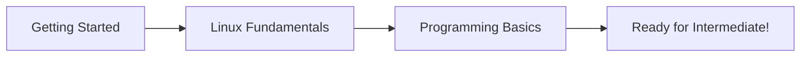

# 🟢 Beginner Topics

Welcome to the beginning of your Platform Engineering journey! This section covers the fundamental knowledge you need before diving into more advanced topics.

## Prerequisites

**None!** This is your starting point. We assume only basic computer knowledge.

## What You'll Learn

### 1. [Getting Started](getting-started)
- What is Platform Engineering?
- Understanding the role and responsibilities
- Setting up your learning environment
- Career landscape and opportunities

### 2. [Linux & System Fundamentals](linux-fundamentals)
- Linux command line mastery
- File systems and permissions
- Process management
- Basic networking
- Package management

### 3. [Programming for Platform Engineers](programming-basics)
- Python for automation
- Go basics for tools
- Data structures you need
- API fundamentals
- Best practices

## Time Investment

- **Total time**: 8-12 hours
- **Recommended pace**: 1-2 weeks
- **Practice time**: Additional 10-15 hours

## Learning Path

## Study Tips

1. **Hands-on Practice**: Don't just read - type every command
2. **Build Projects**: Create small tools as you learn
3. **Take Notes**: Document commands you find useful
4. **Ask Questions**: Join communities when stuck
5. **Be Patient**: Everyone starts somewhere!

## Skills Checklist

By the end of this section, you should be able to:

- [ ] Explain what Platform Engineering is and how it differs from related roles
- [ ] Navigate Linux systems confidently
- [ ] Write basic shell scripts
- [ ] Create Python scripts for automation
- [ ] Understand basic Go syntax
- [ ] Work with APIs and data structures
- [ ] Set up a development environment

## Common Challenges

### "I'm overwhelmed by all the commands!"
Start with the essentials. You don't need to memorize everything - build muscle memory through practice.

### "Programming seems difficult"
Begin with simple scripts. Automate one small task at a time. Complexity comes with experience.

### "I don't have a Linux machine"
- Use WSL2 on Windows
- Use a VM with VirtualBox
- Try cloud platforms' free tiers
- Use online environments like Katacoda

## Next Steps

After completing all beginner topics:
1. Move to [Intermediate Topics](../intermediate/)
2. Start building a portfolio project
3. Contribute to open-source projects
4. Join Platform Engineering communities

## Quick Resources

- 🎮 **Interactive Learning**: [Linux Survival](https://linuxsurvival.com/)
- 📚 **Free Book**: [The Linux Command Line](https://linuxcommand.org/tlcl.php)
- 🎥 **Video Series**: [Linux for Beginners](https://www.youtube.com/playlist?list=PLIhvC56v63IJIujb5cyE13oLuyORZpdkL)
- 💬 **Community**: [Platform Engineering Slack](https://platformengineering.org/slack)

Ready to begin? Start with [Getting Started →](getting-started)