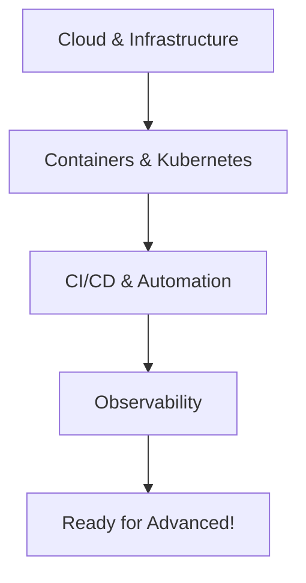

# 🟡 Intermediate Topics

Welcome to the intermediate level! This section covers the core technologies and practices that form the backbone of platform engineering.

## Prerequisites

- Complete **[Beginner Topics](/learn/beginner)** OR
- Have 1+ years of experience in software development or operations
- Comfortable with Linux command line and basic programming

## What You'll Learn

### 1. [Cloud & Infrastructure](cloud-infrastructure)
Master the fundamentals of cloud computing:
- AWS, GCP, and Azure essentials
- Infrastructure as Code with Terraform
- Network architecture and security
- Cost optimization strategies

### 2. [Containers & Kubernetes](containers-kubernetes)
Become proficient in container orchestration:
- Docker deep dive
- Kubernetes architecture and operations
- Service mesh and networking
- Security best practices

### 3. [CI/CD & Automation](cicd-automation)
Build robust automation pipelines:
- GitOps principles
- Pipeline design patterns
- Deployment strategies
- Testing automation

### 4. [Observability & Monitoring](observability)
Implement comprehensive monitoring:
- Metrics collection and analysis
- Distributed tracing
- Log aggregation
- Alert design and SLOs

## Time Investment

- **Total time**: 40-60 hours
- **Recommended pace**: 4-6 weeks
- **Practice time**: Additional 30-40 hours

## Learning Path

## Skills You'll Gain

By completing this section, you will be able to:

- [ ] Deploy and manage cloud infrastructure using IaC
- [ ] Design and operate Kubernetes clusters
- [ ] Build end-to-end CI/CD pipelines
- [ ] Implement comprehensive monitoring solutions
- [ ] Troubleshoot complex distributed systems
- [ ] Optimize costs and performance
- [ ] Design for security and compliance

## Real-World Projects

### Infrastructure as Code
Build a complete multi-environment infrastructure:
- VPC with public/private subnets
- Auto-scaling application clusters
- Managed database instances
- Monitoring and logging stack

### Kubernetes Platform
Deploy a production-ready Kubernetes platform:
- Multi-node cluster setup
- Ingress and service mesh
- GitOps deployment pipeline
- Security policies and RBAC

### CI/CD Pipeline
Create an enterprise-grade pipeline:
- Multi-stage builds
- Automated testing
- Progressive deployments
- Rollback capabilities

## Common Challenges

### "There's so much to learn!"
Focus on one technology at a time. Build projects to reinforce learning. The concepts interconnect and build upon each other.

### "I don't have access to cloud resources"
- Use free tiers (AWS, GCP, Azure)
- Try local alternatives (kind, minikube)
- Use online playgrounds (Katacoda, Play with Kubernetes)

### "How do I practice at scale?"
Start small and gradually increase complexity. Use tools like LocalStack for cloud simulation.

## Industry Context

### Why These Skills Matter
- **Cloud**: 94% of enterprises use cloud services
- **Kubernetes**: 83% of organizations use container orchestration
- **CI/CD**: Average deployment frequency increased 200% with automation
- **Observability**: Reduces MTTR by 69% on average

### Career Impact
Mastering these intermediate topics typically leads to:
- 40-60% salary increase from entry level
- Eligibility for senior positions
- Ability to lead technical initiatives
- Recognition as a platform expert

## Certification Paths

Consider these certifications after completing topics:
- **AWS**: Solutions Architect Associate
- **GCP**: Associate Cloud Engineer
- **Azure**: Azure Administrator
- **Kubernetes**: CKA (Certified Kubernetes Administrator)
- **Terraform**: HashiCorp Certified Terraform Associate

## Study Tips

1. **Build While Learning**: Don't just read - implement everything
2. **Use Version Control**: Track all your infrastructure code
3. **Document Everything**: Your future self will thank you
4. **Join Communities**: Get help when stuck
5. **Share Knowledge**: Blog or present what you learn

## Next Steps

After mastering intermediate topics:
1. Move to [Advanced Topics](/learn/advanced)
2. Build portfolio projects
3. Contribute to open source
4. Start interviewing for senior roles

Ready to dive deep? Start with [Cloud & Infrastructure →](cloud-infrastructure)