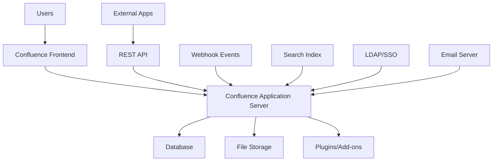

# Confluence - Enterprise Wiki and Documentation Platform

Atlassian Confluence is a collaborative workspace and documentation platform that enables teams to create, organize, and share knowledge. It's widely used for technical documentation, project planning, and team collaboration.

## Architecture



## Installation

### Cloud (Atlassian Cloud)
```bash
# Sign up for Confluence Cloud
# https://www.atlassian.com/software/confluence

# No installation required - fully managed
```

### Server/Data Center Installation
```bash
# Download Confluence
wget https://product-downloads.atlassian.com/software/confluence/downloads/atlassian-confluence-8.5.0.tar.gz

# Extract and install
tar -xzf atlassian-confluence-8.5.0.tar.gz
cd atlassian-confluence-8.5.0

# Configure
./bin/start-confluence.sh
```

### Docker Installation
```yaml
# docker-compose.yml
version: '3.8'
services:
  confluence:
    image: atlassian/confluence:8.5.0
    container_name: confluence
    ports:
      - "8090:8090"
      - "8091:8091"
    environment:
      - ATL_PROXY_NAME=confluence.example.com
      - ATL_PROXY_PORT=443
      - ATL_TOMCAT_SCHEME=https
      - ATL_TOMCAT_SECURE=true
      - JVM_MINIMUM_MEMORY=1024m
      - JVM_MAXIMUM_MEMORY=2048m
    volumes:
      - confluence-data:/var/atlassian/application-data/confluence
    depends_on:
      - postgres

  postgres:
    image: postgres:13
    container_name: confluence-db
    environment:
      - POSTGRES_DB=confluence
      - POSTGRES_USER=confluence
      - POSTGRES_PASSWORD=confluence_password
    volumes:
      - postgres-data:/var/lib/postgresql/data

volumes:
  confluence-data:
  postgres-data:
```

## Configuration

### Database Configuration
```bash
# PostgreSQL setup
sudo -u postgres createuser confluence
sudo -u postgres createdb -O confluence confluence

# MySQL setup
mysql -u root -p
CREATE DATABASE confluence CHARACTER SET utf8mb4 COLLATE utf8mb4_bin;
CREATE USER 'confluence'@'localhost' IDENTIFIED BY 'password';
GRANT ALL PRIVILEGES ON confluence.* TO 'confluence'@'localhost';
```

### Server Configuration
```xml
<!-- server.xml -->
<Server port="8000" shutdown="SHUTDOWN" debug="0">
    <Service name="Tomcat-Standalone">
        <Connector port="8090" 
                   connectionTimeout="20000" 
                   redirectPort="8443"
                   maxThreads="48" 
                   minSpareThreads="10"
                   enableLookups="false" 
                   acceptCount="10" 
                   debug="0" 
                   URIEncoding="UTF-8"
                   protocol="org.apache.coyote.http11.Http11NioProtocol"/>
        
        <Engine name="Standalone" defaultHost="localhost" debug="0">
            <Host name="localhost" debug="0" appBase="webapps" 
                  unpackWARs="true" autoDeploy="false" 
                  startStopThreads="4">
                <Context path="" docBase="../confluence" 
                         debug="0" reloadable="false" 
                         useHttpOnly="true">
                </Context>
            </Host>
        </Engine>
    </Service>
</Server>
```

### Memory Configuration
```bash
# setenv.sh
CATALINA_OPTS="-Xms1024m -Xmx2048m -XX:+UseG1GC"
export CATALINA_OPTS
```

## REST API Usage

### Authentication
```python
import requests
from requests.auth import HTTPBasicAuth

# Basic Auth
auth = HTTPBasicAuth('username', 'api_token')

# Session based
session = requests.Session()
session.auth = auth
```

### Content Operations
```python
import requests
import json

class ConfluenceAPI:
    def __init__(self, base_url, username, api_token):
        self.base_url = base_url.rstrip('/')
        self.auth = (username, api_token)
        self.headers = {
            'Accept': 'application/json',
            'Content-Type': 'application/json'
        }
    
    def get_page(self, page_id):
        """Get page by ID"""
        url = f"{self.base_url}/rest/api/content/{page_id}"
        params = {
            'expand': 'body.storage,version,space'
        }
        
        response = requests.get(url, auth=self.auth, params=params)
        return response.json() if response.status_code == 200 else None
    
    def get_page_by_title(self, space_key, title):
        """Get page by title in space"""
        url = f"{self.base_url}/rest/api/content"
        params = {
            'spaceKey': space_key,
            'title': title,
            'expand': 'body.storage,version'
        }
        
        response = requests.get(url, auth=self.auth, params=params)
        results = response.json().get('results', [])
        return results[0] if results else None
    
    def create_page(self, space_key, title, content, parent_id=None):
        """Create new page"""
        url = f"{self.base_url}/rest/api/content"
        
        data = {
            'type': 'page',
            'title': title,
            'space': {'key': space_key},
            'body': {
                'storage': {
                    'value': content,
                    'representation': 'storage'
                }
            }
        }
        
        if parent_id:
            data['ancestors'] = [{'id': parent_id}]
        
        response = requests.post(
            url, 
            auth=self.auth, 
            headers=self.headers,
            data=json.dumps(data)
        )
        return response.json() if response.status_code == 200 else None
    
    def update_page(self, page_id, title, content, version_number):
        """Update existing page"""
        url = f"{self.base_url}/rest/api/content/{page_id}"
        
        data = {
            'version': {'number': version_number + 1},
            'title': title,
            'type': 'page',
            'body': {
                'storage': {
                    'value': content,
                    'representation': 'storage'
                }
            }
        }
        
        response = requests.put(
            url,
            auth=self.auth,
            headers=self.headers,
            data=json.dumps(data)
        )
        return response.json() if response.status_code == 200 else None
    
    def search_content(self, cql_query, limit=25):
        """Search content using CQL"""
        url = f"{self.base_url}/rest/api/content/search"
        params = {
            'cql': cql_query,
            'limit': limit,
            'expand': 'body.view,version,space'
        }
        
        response = requests.get(url, auth=self.auth, params=params)
        return response.json().get('results', []) if response.status_code == 200 else []

# Usage example
confluence = ConfluenceAPI(
    'https://your-domain.atlassian.net',
    'your-email@example.com',
    'your-api-token'
)

# Get page
page = confluence.get_page('123456789')

# Create page
new_page = confluence.create_page(
    space_key='DOC',
    title='API Documentation',
    content='<h1>Welcome to our API docs</h1>'
)

# Search
results = confluence.search_content('space=DOC and type=page')
```

### Space Management
```python
def get_spaces(self):
    """Get all spaces"""
    url = f"{self.base_url}/rest/api/space"
    params = {'expand': 'description.plain,homepage'}
    
    response = requests.get(url, auth=self.auth, params=params)
    return response.json().get('results', []) if response.status_code == 200 else []

def create_space(self, key, name, description):
    """Create new space"""
    url = f"{self.base_url}/rest/api/space"
    
    data = {
        'key': key,
        'name': name,
        'description': {
            'plain': {
                'value': description,
                'representation': 'plain'
            }
        }
    }
    
    response = requests.post(
        url,
        auth=self.auth,
        headers=self.headers,
        data=json.dumps(data)
    )
    return response.json() if response.status_code == 200 else None
```

## Content Creation

### Storage Format (XHTML)
```xml
<!-- Basic page structure -->
<h1>Page Title</h1>
<p>This is a paragraph with <strong>bold</strong> and <em>italic</em> text.</p>

<h2>Lists</h2>
<ul>
    <li>Bullet point 1</li>
    <li>Bullet point 2</li>
</ul>

<ol>
    <li>Numbered item 1</li>
    <li>Numbered item 2</li>
</ol>

<!-- Tables -->
<table>
    <tbody>
        <tr>
            <th>Header 1</th>
            <th>Header 2</th>
        </tr>
        <tr>
            <td>Cell 1</td>
            <td>Cell 2</td>
        </tr>
    </tbody>
</table>

<!-- Links -->
<p>
    <a href="https://example.com">External link</a>
</p>

<!-- Confluence-specific macros -->
<ac:structured-macro ac:name="info">
    <ac:rich-text-body>
        <p>This is an info panel</p>
    </ac:rich-text-body>
</ac:structured-macro>

<ac:structured-macro ac:name="code">
    <ac:parameter ac:name="language">python</ac:parameter>
    <ac:plain-text-body>
def hello_world():
    print("Hello, World!")
    </ac:plain-text-body>
</ac:structured-macro>
```

### Macro Examples
```xml
<!-- Table of Contents -->
<ac:structured-macro ac:name="toc">
    <ac:parameter ac:name="maxLevel">3</ac:parameter>
</ac:structured-macro>

<!-- Code Block -->
<ac:structured-macro ac:name="code">
    <ac:parameter ac:name="language">javascript</ac:parameter>
    <ac:parameter ac:name="title">Example Code</ac:parameter>
    <ac:plain-text-body>
const api = {
    baseUrl: 'https://api.example.com',
    get: async (endpoint) => {
        const response = await fetch(`${api.baseUrl}${endpoint}`);
        return response.json();
    }
};
    </ac:plain-text-body>
</ac:structured-macro>

<!-- Status Macro -->
<ac:structured-macro ac:name="status">
    <ac:parameter ac:name="colour">Green</ac:parameter>
    <ac:parameter ac:name="title">APPROVED</ac:parameter>
</ac:structured-macro>

<!-- Include Page -->
<ac:structured-macro ac:name="include">
    <ac:parameter ac:name="page">Common Footer</ac:parameter>
</ac:structured-macro>

<!-- Confluence Cloud only - Smart Links -->
<ac:link>
    <ri:url ri:value="https://github.com/example/repo"/>
</ac:link>
```

## Automation Scripts

### Bulk Page Creation
```python
#!/usr/bin/env python3
import csv
from confluence_api import ConfluenceAPI
import time

def create_pages_from_csv(confluence, csv_file, space_key):
    """Create pages from CSV file"""
    with open(csv_file, 'r') as file:
        reader = csv.DictReader(file)
        
        for row in reader:
            title = row['title']
            content = row['content']
            parent_title = row.get('parent', '')
            
            # Find parent page if specified
            parent_id = None
            if parent_title:
                parent = confluence.get_page_by_title(space_key, parent_title)
                if parent:
                    parent_id = parent['id']
            
            # Create page
            print(f"Creating page: {title}")
            page = confluence.create_page(
                space_key=space_key,
                title=title,
                content=content,
                parent_id=parent_id
            )
            
            if page:
                print(f"Created page: {page['id']}")
            else:
                print(f"Failed to create page: {title}")
            
            # Rate limiting
            time.sleep(1)

# Usage
confluence = ConfluenceAPI(
    'https://your-domain.atlassian.net',
    'your-email@example.com',
    'your-api-token'
)

create_pages_from_csv(confluence, 'pages.csv', 'DOC')
```

### Documentation Sync
```python
#!/usr/bin/env python3
import os
import markdown
from confluence_api import ConfluenceAPI

class MarkdownToConfluence:
    def __init__(self, confluence_api):
        self.confluence = confluence_api
    
    def markdown_to_storage(self, md_content):
        """Convert Markdown to Confluence Storage format"""
        # Basic conversion - enhance as needed
        html = markdown.markdown(md_content, extensions=[
            'markdown.extensions.tables',
            'markdown.extensions.fenced_code',
            'markdown.extensions.toc'
        ])
        
        # Convert to Confluence storage format
        storage = html.replace('<pre><code>', '<ac:structured-macro ac:name="code"><ac:plain-text-body>')
        storage = storage.replace('</code></pre>', '</ac:plain-text-body></ac:structured-macro>')
        
        return storage
    
    def sync_directory(self, directory, space_key, page_mapping=None):
        """Sync markdown files to Confluence"""
        page_mapping = page_mapping or {}
        
        for root, dirs, files in os.walk(directory):
            for file in files:
                if file.endswith('.md'):
                    file_path = os.path.join(root, file)
                    relative_path = os.path.relpath(file_path, directory)
                    
                    # Determine page title
                    title = page_mapping.get(relative_path) or file.replace('.md', '').replace('_', ' ').title()
                    
                    # Read markdown content
                    with open(file_path, 'r', encoding='utf-8') as f:
                        md_content = f.read()
                    
                    # Convert to storage format
                    storage_content = self.markdown_to_storage(md_content)
                    
                    # Check if page exists
                    existing_page = self.confluence.get_page_by_title(space_key, title)
                    
                    if existing_page:
                        # Update existing page
                        print(f"Updating page: {title}")
                        self.confluence.update_page(
                            page_id=existing_page['id'],
                            title=title,
                            content=storage_content,
                            version_number=existing_page['version']['number']
                        )
                    else:
                        # Create new page
                        print(f"Creating page: {title}")
                        self.confluence.create_page(
                            space_key=space_key,
                            title=title,
                            content=storage_content
                        )

# Usage
confluence = ConfluenceAPI(
    'https://your-domain.atlassian.net',
    'your-email@example.com',
    'your-api-token'
)

sync = MarkdownToConfluence(confluence)
sync.sync_directory('./docs', 'DOC')
```

### Template Management
```python
def create_template(self, space_key, template_name, template_content):
    """Create page template"""
    url = f"{self.base_url}/rest/api/template"
    
    data = {
        'name': template_name,
        'templateType': 'page',
        'body': {
            'storage': {
                'value': template_content,
                'representation': 'storage'
            }
        },
        'space': {'key': space_key}
    }
    
    response = requests.post(
        url,
        auth=self.auth,
        headers=self.headers,
        data=json.dumps(data)
    )
    return response.json() if response.status_code == 200 else None

# Template content example
api_doc_template = """
<h1>API Documentation</h1>

<ac:structured-macro ac:name="toc"/>

<h2>Overview</h2>
<p>Brief description of the API</p>

<h2>Authentication</h2>
<ac:structured-macro ac:name="code">
    <ac:parameter ac:name="language">bash</ac:parameter>
    <ac:plain-text-body>
curl -H "Authorization: Bearer YOUR_TOKEN" \\
     https://api.example.com/endpoint
    </ac:plain-text-body>
</ac:structured-macro>

<h2>Endpoints</h2>
<table>
    <tbody>
        <tr>
            <th>Method</th>
            <th>Endpoint</th>
            <th>Description</th>
        </tr>
        <tr>
            <td>GET</td>
            <td>/api/v1/resource</td>
            <td>Get resource</td>
        </tr>
    </tbody>
</table>

<h2>Examples</h2>
<ac:structured-macro ac:name="expand">
    <ac:parameter ac:name="title">Show examples</ac:parameter>
    <ac:rich-text-body>
        <p>Example content here</p>
    </ac:rich-text-body>
</ac:structured-macro>
"""
```

## Advanced Features

### Custom Macros
```xml
<!-- Custom macro definition -->
<ac:structured-macro ac:name="my-custom-macro">
    <ac:parameter ac:name="title">Custom Title</ac:parameter>
    <ac:parameter ac:name="color">blue</ac:parameter>
    <ac:rich-text-body>
        <p>Custom macro content</p>
    </ac:rich-text-body>
</ac:structured-macro>
```

### Webhooks
```python
from flask import Flask, request, jsonify
import json

app = Flask(__name__)

@app.route('/confluence-webhook', methods=['POST'])
def handle_webhook():
    """Handle Confluence webhook events"""
    event_data = request.json
    event_type = event_data.get('eventType')
    
    if event_type == 'page_created':
        page = event_data['page']
        print(f"Page created: {page['title']} in space {page['space']['key']}")
        
        # Process page creation
        process_new_page(page)
        
    elif event_type == 'page_updated':
        page = event_data['page']
        print(f"Page updated: {page['title']}")
        
        # Process page update
        process_page_update(page)
    
    return jsonify({'status': 'received'}), 200

def process_new_page(page):
    """Process newly created page"""
    # Add automatic tags, notifications, etc.
    pass

def process_page_update(page):
    """Process page updates"""
    # Trigger builds, send notifications, etc.
    pass

if __name__ == '__main__':
    app.run(host='0.0.0.0', port=5000)
```

### Search and Analytics
```python
def advanced_search(self, query_params):
    """Advanced content search with analytics"""
    url = f"{self.base_url}/rest/api/search"
    
    # CQL query examples
    cql_queries = {
        'recent_pages': 'type=page and lastModified >= -7d',
        'popular_pages': 'type=page order by lastModified desc',
        'orphaned_pages': 'type=page and parent = null',
        'large_pages': 'type=page and text ~ "length > 10000"',
        'outdated_pages': 'type=page and lastModified <= -180d'
    }
    
    results = {}
    for query_name, cql in cql_queries.items():
        params = {
            'cql': cql,
            'limit': query_params.get('limit', 50),
            'expand': 'body.view,version,space,metadata.labels'
        }
        
        response = requests.get(url, auth=self.auth, params=params)
        if response.status_code == 200:
            results[query_name] = response.json().get('results', [])
    
    return results

def generate_analytics_report(self, space_key=None):
    """Generate analytics report"""
    analytics = self.advanced_search({'limit': 1000})
    
    report = {
        'summary': {
            'total_pages': 0,
            'recent_updates': len(analytics.get('recent_pages', [])),
            'orphaned_pages': len(analytics.get('orphaned_pages', [])),
            'outdated_pages': len(analytics.get('outdated_pages', []))
        },
        'top_contributors': {},
        'space_distribution': {},
        'content_health': {
            'pages_needing_review': [],
            'broken_links': [],
            'missing_labels': []
        }
    }
    
    # Analyze all pages
    all_pages = analytics.get('popular_pages', [])
    report['summary']['total_pages'] = len(all_pages)
    
    for page in all_pages:
        # Count contributors
        author = page.get('version', {}).get('by', {}).get('displayName', 'Unknown')
        report['top_contributors'][author] = report['top_contributors'].get(author, 0) + 1
        
        # Count by space
        space = page.get('space', {}).get('key', 'Unknown')
        report['space_distribution'][space] = report['space_distribution'].get(space, 0) + 1
        
        # Check for issues
        if not page.get('metadata', {}).get('labels'):
            report['content_health']['missing_labels'].append(page['title'])
    
    return report
```

## CI/CD Integration

### GitHub Actions
```yaml
# .github/workflows/docs-to-confluence.yml
name: Sync Docs to Confluence

on:
  push:
    branches: [main]
    paths: ['docs/**']

jobs:
  sync-confluence:
    runs-on: ubuntu-latest
    steps:
    - uses: actions/checkout@v3
    
    - name: Setup Python
      uses: actions/setup-python@v4
      with:
        python-version: '3.9'
    
    - name: Install dependencies
      run: |
        pip install requests markdown
    
    - name: Sync to Confluence
      env:
        CONFLUENCE_URL: ${{ secrets.CONFLUENCE_URL }}
        CONFLUENCE_USER: ${{ secrets.CONFLUENCE_USER }}
        CONFLUENCE_TOKEN: ${{ secrets.CONFLUENCE_TOKEN }}
        SPACE_KEY: ${{ secrets.SPACE_KEY }}
      run: |
        python scripts/sync-to-confluence.py
```

### Jenkins Pipeline
```groovy
pipeline {
    agent any
    
    environment {
        CONFLUENCE_URL = credentials('confluence-url')
        CONFLUENCE_USER = credentials('confluence-user')
        CONFLUENCE_TOKEN = credentials('confluence-token')
    }
    
    stages {
        stage('Sync Documentation') {
            steps {
                script {
                    sh '''
                        python3 -m pip install requests markdown
                        python3 scripts/confluence-sync.py \
                            --url $CONFLUENCE_URL \
                            --user $CONFLUENCE_USER \
                            --token $CONFLUENCE_TOKEN \
                            --space DOC \
                            --source ./docs
                    '''
                }
            }
        }
    }
    
    post {
        success {
            slackSend(
                channel: '#docs',
                message: "Documentation synced to Confluence successfully"
            )
        }
        failure {
            slackSend(
                channel: '#docs',
                message: "Failed to sync documentation to Confluence"
            )
        }
    }
}
```

## Best Practices

### Content Organization
- Use clear, hierarchical page structures
- Implement consistent naming conventions
- Create reusable templates for common content types
- Use labels and categories for better discoverability
- Maintain a style guide for consistent formatting

### Performance Optimization
- Use page includes for shared content
- Optimize images and attachments
- Implement proper caching strategies
- Monitor page load times
- Clean up orphaned content regularly

### Security and Governance
- Implement proper space permissions
- Use groups for access management
- Regular audit of user permissions
- Set up content retention policies
- Monitor and log administrative changes

### Integration Patterns
```python
# Documentation as Code pattern
class DocumentationPipeline:
    def __init__(self, confluence_api, git_repo):
        self.confluence = confluence_api
        self.git_repo = git_repo
    
    def sync_on_commit(self, commit_hash):
        """Sync documentation on git commit"""
        changed_files = self.get_changed_docs(commit_hash)
        
        for file_path in changed_files:
            if file_path.endswith('.md'):
                self.sync_markdown_file(file_path)
    
    def get_changed_docs(self, commit_hash):
        """Get list of changed documentation files"""
        # Implementation to get changed files from git
        pass
    
    def sync_markdown_file(self, file_path):
        """Sync individual markdown file"""
        # Implementation to convert and sync file
        pass
```

## Troubleshooting

### Common Issues

**API Rate Limiting**
```python
import time
from functools import wraps

def rate_limit(calls_per_second=1):
    def decorator(func):
        last_called = [0.0]
        
        @wraps(func)
        def wrapper(*args, **kwargs):
            elapsed = time.time() - last_called[0]
            left_to_wait = 1.0 / calls_per_second - elapsed
            if left_to_wait > 0:
                time.sleep(left_to_wait)
            
            result = func(*args, **kwargs)
            last_called[0] = time.time()
            return result
        
        return wrapper
    return decorator

# Apply rate limiting
@rate_limit(calls_per_second=2)
def create_page_with_limit(self, *args, **kwargs):
    return self.create_page(*args, **kwargs)
```

**Storage Format Validation**
```python
import xml.etree.ElementTree as ET

def validate_storage_format(storage_content):
    """Validate Confluence storage format"""
    try:
        # Wrap in root element for parsing
        wrapped = f"<root>{storage_content}</root>"
        ET.fromstring(wrapped)
        return True, "Valid XML"
    except ET.ParseError as e:
        return False, f"Invalid XML: {str(e)}"

def clean_storage_content(content):
    """Clean and fix common storage format issues"""
    # Remove invalid characters
    content = content.replace('\x0b', '')
    content = content.replace('\x0c', '')
    
    # Fix unclosed tags
    content = content.replace('<br>', '<br/>')
    content = content.replace('<hr>', '<hr/>')
    
    return content
```

**Large Content Handling**
```python
def upload_large_content(self, page_id, content, chunk_size=50000):
    """Handle large content uploads by chunking"""
    if len(content) <= chunk_size:
        return self.update_page(page_id, content)
    
    # Split content into chunks and create child pages
    chunks = [content[i:i+chunk_size] for i in range(0, len(content), chunk_size)]
    
    for i, chunk in enumerate(chunks):
        child_title = f"Content Part {i+1}"
        self.create_page(
            space_key=space_key,
            title=child_title,
            content=chunk,
            parent_id=page_id
        )
```

## Resources

- [Confluence REST API Documentation](https://developer.atlassian.com/cloud/confluence/rest/v2/)
- [Confluence Storage Format Guide](https://confluence.atlassian.com/doc/confluence-storage-format-790796544.html)
- [Atlassian Developer Community](https://community.developer.atlassian.com/)
- [Confluence Python SDK](https://pypi.org/project/atlassian-python-api/)
- [Macro Development Guide](https://developer.atlassian.com/server/confluence/confluence-plugin-guide/)