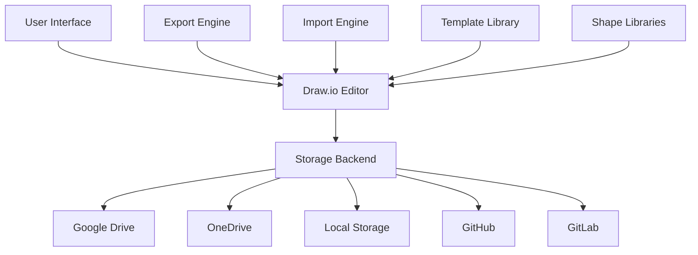

# Draw.io (diagrams.net) - Web-based Diagramming Tool

Draw.io, now known as diagrams.net, is a free online diagramming application that can create flowcharts, UML diagrams, network diagrams, and many other types of technical diagrams. It supports both web-based and desktop applications.

## Architecture



## Getting Started

### Web Application
```javascript
// Access draw.io online
// https://app.diagrams.net

// Embed in web applications
<iframe src="https://app.diagrams.net/?embed=1&ui=kennedy&spin=1&modified=unsavedChanges&proto=json" 
        width="100%" height="600px"></iframe>
```

### Desktop Application
```bash
# Download from GitHub releases
wget https://github.com/jgraph/drawio-desktop/releases/latest/download/drawio-amd64-21.7.5.deb

# Install on Ubuntu/Debian
sudo dpkg -i drawio-amd64-21.7.5.deb

# macOS (using Homebrew)
brew install --cask drawio

# Windows (using Chocolatey)
choco install drawio
```

### Docker Deployment
```yaml
# docker-compose.yml
version: '3.8'
services:
  drawio:
    image: jgraph/drawio:latest
    ports:
      - "8080:8080"
      - "8443:8443"
    environment:
      - DRAWIO_BASE_URL=https://your-domain.com
      - DRAWIO_CSP_HEADER=default-src 'self'
    volumes:
      - ./config:/usr/local/tomcat/webapps/draw/WEB-INF/classes
    restart: unless-stopped

  # Self-hosted with authentication
  drawio-auth:
    image: jgraph/drawio:latest
    ports:
      - "8080:8080"
    environment:
      - DRAWIO_VIEWER_URL=https://viewer.diagrams.net
      - DRAWIO_LIGHTBOX_URL=https://viewer.diagrams.net
      - DRAWIO_CONFIG={"compressXml":true,"auth":{"enabled":true}}
    volumes:
      - ./drawio-config.json:/usr/local/tomcat/webapps/draw/js/PreConfig.js
```

## File Formats and Integration

### Supported Formats
```javascript
// Export formats
const exportFormats = {
    'PNG': 'Raster image with transparency support',
    'JPEG': 'Compressed raster image',
    'SVG': 'Scalable vector graphics',
    'PDF': 'Portable document format',
    'HTML': 'Web page with embedded diagram',
    'XML': 'Native draw.io format',
    'VSDX': 'Microsoft Visio format',
    'VDML': 'Draw.io markup language'
};

// Import formats
const importFormats = {
    'XML': 'Native draw.io format',
    'VSDX': 'Microsoft Visio files',
    'Lucidchart': 'Lucidchart diagrams',
    'Gliffy': 'Gliffy diagrams',
    'OmniGraffle': 'OmniGraffle files'
};
```

### Programmatic Integration
```javascript
// Embed draw.io in web application
class DrawIOEmbed {
    constructor(containerId, options = {}) {
        this.container = document.getElementById(containerId);
        this.options = {
            ui: 'kennedy',
            spin: 1,
            modified: 'unsavedChanges',
            proto: 'json',
            ...options
        };
        this.iframe = null;
        this.init();
    }
    
    init() {
        this.iframe = document.createElement('iframe');
        this.iframe.style.width = '100%';
        this.iframe.style.height = '600px';
        this.iframe.style.border = 'none';
        
        const params = new URLSearchParams(this.options);
        this.iframe.src = `https://app.diagrams.net/?embed=1&${params}`;
        
        this.container.appendChild(this.iframe);
        this.setupMessageHandling();
    }
    
    setupMessageHandling() {
        window.addEventListener('message', (event) => {
            if (event.source === this.iframe.contentWindow) {
                this.handleMessage(event.data);
            }
        });
    }
    
    handleMessage(data) {
        try {
            const message = JSON.parse(data);
            
            switch (message.event) {
                case 'init':
                    this.onInit();
                    break;
                case 'save':
                    this.onSave(message.xml);
                    break;
                case 'exit':
                    this.onExit();
                    break;
                case 'export':
                    this.onExport(message.data);
                    break;
            }
        } catch (e) {
            console.error('Failed to parse message:', e);
        }
    }
    
    loadDiagram(xml) {
        const message = {
            action: 'load',
            xml: xml,
            autosave: 1
        };
        this.iframe.contentWindow.postMessage(JSON.stringify(message), '*');
    }
    
    saveDiagram() {
        const message = { action: 'export', format: 'xml' };
        this.iframe.contentWindow.postMessage(JSON.stringify(message), '*');
    }
    
    exportDiagram(format = 'png') {
        const message = {
            action: 'export',
            format: format,
            spinKey: 'saving'
        };
        this.iframe.contentWindow.postMessage(JSON.stringify(message), '*');
    }
    
    onInit() {
        console.log('Draw.io initialized');
    }
    
    onSave(xml) {
        console.log('Diagram saved:', xml);
        // Save to your backend
        this.saveDiagramToServer(xml);
    }
    
    onExit() {
        console.log('Draw.io exited');
    }
    
    onExport(data) {
        console.log('Diagram exported:', data);
        // Handle exported data
        this.downloadFile(data);
    }
    
    async saveDiagramToServer(xml) {
        try {
            const response = await fetch('/api/diagrams', {
                method: 'POST',
                headers: {
                    'Content-Type': 'application/json',
                },
                body: JSON.stringify({ xml: xml })
            });
            
            if (response.ok) {
                console.log('Diagram saved to server');
            }
        } catch (error) {
            console.error('Failed to save diagram:', error);
        }
    }
    
    downloadFile(data) {
        const blob = new Blob([data], { type: 'application/octet-stream' });
        const url = URL.createObjectURL(blob);
        const a = document.createElement('a');
        a.href = url;
        a.download = 'diagram.png';
        a.click();
        URL.revokeObjectURL(url);
    }
}

// Usage
const drawio = new DrawIOEmbed('drawio-container', {
    ui: 'kennedy',
    libraries: 1,
    saveAndExit: 1
});
```

## Backend Integration

### Node.js API Server
```javascript
const express = require('express');
const multer = require('multer');
const fs = require('fs').promises;
const path = require('path');

const app = express();
const upload = multer({ dest: 'uploads/' });

app.use(express.json({ limit: '50mb' }));
app.use(express.static('public'));

// Serve draw.io diagrams
app.get('/api/diagrams/:id', async (req, res) => {
    try {
        const diagramPath = path.join(__dirname, 'diagrams', `${req.params.id}.xml`);
        const xml = await fs.readFile(diagramPath, 'utf8');
        res.json({ xml });
    } catch (error) {
        res.status(404).json({ error: 'Diagram not found' });
    }
});

// Save draw.io diagrams
app.post('/api/diagrams', async (req, res) => {
    try {
        const { id, xml, title } = req.body;
        
        if (!xml) {
            return res.status(400).json({ error: 'XML content required' });
        }
        
        const diagramId = id || generateId();
        const diagramPath = path.join(__dirname, 'diagrams', `${diagramId}.xml`);
        
        await fs.writeFile(diagramPath, xml);
        
        // Save metadata
        const metadata = {
            id: diagramId,
            title: title || 'Untitled',
            created: new Date().toISOString(),
            modified: new Date().toISOString()
        };
        
        const metadataPath = path.join(__dirname, 'diagrams', `${diagramId}.json`);
        await fs.writeFile(metadataPath, JSON.stringify(metadata, null, 2));
        
        res.json({ id: diagramId, success: true });
    } catch (error) {
        res.status(500).json({ error: 'Failed to save diagram' });
    }
});

// Convert and export diagrams
app.post('/api/diagrams/:id/export', async (req, res) => {
    try {
        const { format = 'png' } = req.body;
        const diagramPath = path.join(__dirname, 'diagrams', `${req.params.id}.xml`);
        
        const xml = await fs.readFile(diagramPath, 'utf8');
        
        // Use puppeteer to convert via draw.io
        const convertedData = await convertDiagram(xml, format);
        
        res.set({
            'Content-Type': getContentType(format),
            'Content-Disposition': `attachment; filename="diagram.${format}"`
        });
        
        res.send(convertedData);
    } catch (error) {
        res.status(500).json({ error: 'Failed to export diagram' });
    }
});

// List all diagrams
app.get('/api/diagrams', async (req, res) => {
    try {
        const diagramsDir = path.join(__dirname, 'diagrams');
        const files = await fs.readdir(diagramsDir);
        
        const diagrams = [];
        
        for (const file of files) {
            if (file.endsWith('.json')) {
                const metadataPath = path.join(diagramsDir, file);
                const metadata = JSON.parse(await fs.readFile(metadataPath, 'utf8'));
                diagrams.push(metadata);
            }
        }
        
        res.json(diagrams);
    } catch (error) {
        res.status(500).json({ error: 'Failed to list diagrams' });
    }
});

async function convertDiagram(xml, format) {
    const puppeteer = require('puppeteer');
    
    const browser = await puppeteer.launch();
    const page = await browser.newPage();
    
    // Load draw.io with the diagram
    const drawioUrl = `https://app.diagrams.net/?format=${format}&embed=1&spin=1`;
    await page.goto(drawioUrl);
    
    // Wait for draw.io to load
    await page.waitForSelector('iframe');
    
    // Load the diagram
    await page.evaluate((xml) => {
        window.postMessage(JSON.stringify({
            action: 'load',
            xml: xml
        }), '*');
    }, xml);
    
    // Export the diagram
    const exportPromise = new Promise((resolve) => {
        page.on('console', (msg) => {
            if (msg.text().includes('export-complete')) {
                resolve();
            }
        });
    });
    
    await page.evaluate((format) => {
        window.postMessage(JSON.stringify({
            action: 'export',
            format: format
        }), '*');
    }, format);
    
    await exportPromise;
    
    // Get the exported data
    const exportedData = await page.evaluate(() => {
        return window.exportedData;
    });
    
    await browser.close();
    
    return Buffer.from(exportedData, 'base64');
}

function getContentType(format) {
    const types = {
        'png': 'image/png',
        'jpg': 'image/jpeg',
        'svg': 'image/svg+xml',
        'pdf': 'application/pdf',
        'html': 'text/html',
        'xml': 'application/xml'
    };
    return types[format] || 'application/octet-stream';
}

function generateId() {
    return Math.random().toString(36).substr(2, 9);
}

app.listen(3000, () => {
    console.log('Draw.io API server running on port 3000');
});
```

### Python Flask Integration
```python
#!/usr/bin/env python3
from flask import Flask, request, jsonify, send_file
import os
import json
import uuid
import base64
from datetime import datetime
import xml.etree.ElementTree as ET

app = Flask(__name__)

DIAGRAMS_DIR = 'diagrams'
os.makedirs(DIAGRAMS_DIR, exist_ok=True)

class DiagramManager:
    def __init__(self, storage_dir):
        self.storage_dir = storage_dir
    
    def save_diagram(self, xml_content, title=None, diagram_id=None):
        """Save diagram XML and metadata"""
        if not diagram_id:
            diagram_id = str(uuid.uuid4())
        
        # Save XML file
        xml_path = os.path.join(self.storage_dir, f"{diagram_id}.xml")
        with open(xml_path, 'w', encoding='utf-8') as f:
            f.write(xml_content)
        
        # Save metadata
        metadata = {
            'id': diagram_id,
            'title': title or 'Untitled Diagram',
            'created': datetime.now().isoformat(),
            'modified': datetime.now().isoformat(),
            'size': len(xml_content)
        }
        
        metadata_path = os.path.join(self.storage_dir, f"{diagram_id}.json")
        with open(metadata_path, 'w') as f:
            json.dump(metadata, f, indent=2)
        
        return diagram_id
    
    def load_diagram(self, diagram_id):
        """Load diagram XML content"""
        xml_path = os.path.join(self.storage_dir, f"{diagram_id}.xml")
        
        if not os.path.exists(xml_path):
            return None
        
        with open(xml_path, 'r', encoding='utf-8') as f:
            return f.read()
    
    def get_metadata(self, diagram_id):
        """Get diagram metadata"""
        metadata_path = os.path.join(self.storage_dir, f"{diagram_id}.json")
        
        if not os.path.exists(metadata_path):
            return None
        
        with open(metadata_path, 'r') as f:
            return json.load(f)
    
    def list_diagrams(self):
        """List all diagrams with metadata"""
        diagrams = []
        
        for filename in os.listdir(self.storage_dir):
            if filename.endswith('.json'):
                with open(os.path.join(self.storage_dir, filename), 'r') as f:
                    metadata = json.load(f)
                    diagrams.append(metadata)
        
        return sorted(diagrams, key=lambda x: x['modified'], reverse=True)
    
    def delete_diagram(self, diagram_id):
        """Delete diagram and metadata"""
        xml_path = os.path.join(self.storage_dir, f"{diagram_id}.xml")
        metadata_path = os.path.join(self.storage_dir, f"{diagram_id}.json")
        
        deleted = False
        if os.path.exists(xml_path):
            os.remove(xml_path)
            deleted = True
        
        if os.path.exists(metadata_path):
            os.remove(metadata_path)
            deleted = True
        
        return deleted

diagram_manager = DiagramManager(DIAGRAMS_DIR)

@app.route('/api/diagrams', methods=['GET'])
def list_diagrams():
    """List all diagrams"""
    diagrams = diagram_manager.list_diagrams()
    return jsonify(diagrams)

@app.route('/api/diagrams/<diagram_id>', methods=['GET'])
def get_diagram(diagram_id):
    """Get specific diagram"""
    xml_content = diagram_manager.load_diagram(diagram_id)
    
    if not xml_content:
        return jsonify({'error': 'Diagram not found'}), 404
    
    metadata = diagram_manager.get_metadata(diagram_id)
    
    return jsonify({
        'id': diagram_id,
        'xml': xml_content,
        'metadata': metadata
    })

@app.route('/api/diagrams', methods=['POST'])
def create_diagram():
    """Create or update diagram"""
    data = request.json
    
    xml_content = data.get('xml')
    if not xml_content:
        return jsonify({'error': 'XML content required'}), 400
    
    title = data.get('title')
    diagram_id = data.get('id')
    
    saved_id = diagram_manager.save_diagram(xml_content, title, diagram_id)
    
    return jsonify({
        'id': saved_id,
        'success': True
    })

@app.route('/api/diagrams/<diagram_id>', methods=['DELETE'])
def delete_diagram(diagram_id):
    """Delete diagram"""
    deleted = diagram_manager.delete_diagram(diagram_id)
    
    if not deleted:
        return jsonify({'error': 'Diagram not found'}), 404
    
    return jsonify({'success': True})

@app.route('/api/diagrams/<diagram_id>/export/<format>')
def export_diagram(diagram_id, format):
    """Export diagram in specified format"""
    xml_content = diagram_manager.load_diagram(diagram_id)
    
    if not xml_content:
        return jsonify({'error': 'Diagram not found'}), 404
    
    # For this example, we'll return the XML content
    # In a real implementation, you'd use a conversion service
    if format == 'xml':
        return xml_content, 200, {'Content-Type': 'application/xml'}
    else:
        return jsonify({'error': f'Format {format} not supported'}), 400

@app.route('/editor')
def editor():
    """Serve draw.io editor page"""
    return '''
<!DOCTYPE html>
<html>
<head>
    <title>Draw.io Editor</title>
    <style>
        body { margin: 0; font-family: Arial, sans-serif; }
        .header { background: #f5f5f5; padding: 10px; border-bottom: 1px solid #ddd; }
        .toolbar { margin-bottom: 10px; }
        button { margin-right: 10px; padding: 8px 16px; }
        #editor { height: calc(100vh - 80px); }
    </style>
</head>
<body>
    <div class="header">
        <div class="toolbar">
            <button onclick="newDiagram()">New</button>
            <button onclick="saveDiagram()">Save</button>
            <button onclick="loadDiagram()">Load</button>
            <button onclick="exportDiagram('png')">Export PNG</button>
            <input type="file" id="fileInput" accept=".xml,.drawio" style="display: none">
        </div>
    </div>
    
    <div id="editor"></div>
    
    <script>
        let currentDiagramId = null;
        let drawioFrame = null;
        
        function initEditor() {
            const editor = document.getElementById('editor');
            
            drawioFrame = document.createElement('iframe');
            drawioFrame.style.width = '100%';
            drawioFrame.style.height = '100%';
            drawioFrame.style.border = 'none';
            drawioFrame.src = 'https://app.diagrams.net/?embed=1&ui=kennedy&spin=1&modified=unsavedChanges&proto=json';
            
            editor.appendChild(drawioFrame);
            
            window.addEventListener('message', handleMessage);
        }
        
        function handleMessage(event) {
            if (event.source !== drawioFrame.contentWindow) return;
            
            try {
                const message = JSON.parse(event.data);
                
                switch (message.event) {
                    case 'init':
                        console.log('Draw.io initialized');
                        break;
                    case 'save':
                        saveDiagramToServer(message.xml);
                        break;
                    case 'export':
                        downloadExport(message.data, message.format);
                        break;
                }
            } catch (e) {
                console.error('Failed to parse message:', e);
            }
        }
        
        function newDiagram() {
            currentDiagramId = null;
            const message = { action: 'template' };
            drawioFrame.contentWindow.postMessage(JSON.stringify(message), '*');
        }
        
        function saveDiagram() {
            const message = { action: 'export', format: 'xml' };
            drawioFrame.contentWindow.postMessage(JSON.stringify(message), '*');
        }
        
        async function saveDiagramToServer(xml) {
            const title = prompt('Enter diagram title:') || 'Untitled';
            
            try {
                const response = await fetch('/api/diagrams', {
                    method: 'POST',
                    headers: { 'Content-Type': 'application/json' },
                    body: JSON.stringify({
                        id: currentDiagramId,
                        xml: xml,
                        title: title
                    })
                });
                
                const result = await response.json();
                
                if (result.success) {
                    currentDiagramId = result.id;
                    alert('Diagram saved successfully!');
                } else {
                    alert('Failed to save diagram');
                }
            } catch (error) {
                console.error('Save error:', error);
                alert('Failed to save diagram');
            }
        }
        
        async function loadDiagram() {
            try {
                const response = await fetch('/api/diagrams');
                const diagrams = await response.json();
                
                if (diagrams.length === 0) {
                    alert('No diagrams found');
                    return;
                }
                
                // Simple selection (in real app, use a proper dialog)
                const diagramList = diagrams.map(d => `${d.id}: ${d.title}`).join('\\n');
                const selected = prompt(`Select diagram:\\n${diagramList}\\n\\nEnter ID:`);
                
                if (selected) {
                    const diagramResponse = await fetch(`/api/diagrams/${selected}`);
                    const diagram = await diagramResponse.json();
                    
                    if (diagram.xml) {
                        currentDiagramId = selected;
                        const message = {
                            action: 'load',
                            xml: diagram.xml
                        };
                        drawioFrame.contentWindow.postMessage(JSON.stringify(message), '*');
                    }
                }
            } catch (error) {
                console.error('Load error:', error);
                alert('Failed to load diagram');
            }
        }
        
        function exportDiagram(format) {
            const message = {
                action: 'export',
                format: format,
                spinKey: 'export'
            };
            drawioFrame.contentWindow.postMessage(JSON.stringify(message), '*');
        }
        
        function downloadExport(data, format) {
            const blob = new Blob([data], { type: 'application/octet-stream' });
            const url = URL.createObjectURL(blob);
            const a = document.createElement('a');
            a.href = url;
            a.download = `diagram.${format}`;
            document.body.appendChild(a);
            a.click();
            document.body.removeChild(a);
            URL.revokeObjectURL(url);
        }
        
        // Initialize when page loads
        window.onload = initEditor;
    </script>
</body>
</html>
    '''

if __name__ == '__main__':
    app.run(debug=True, port=5000)
```

## Automation and Scripting

### Batch Processing
```python
#!/usr/bin/env python3
import os
import xml.etree.ElementTree as ET
from pathlib import Path
import requests
import base64

class DrawIOProcessor:
    def __init__(self, server_url='https://app.diagrams.net'):
        self.server_url = server_url
    
    def extract_diagram_info(self, xml_file):
        """Extract information from draw.io XML file"""
        try:
            tree = ET.parse(xml_file)
            root = tree.getroot()
            
            # Extract diagram metadata
            info = {
                'file': xml_file,
                'pages': [],
                'elements': 0,
                'compressed': False
            }
            
            # Check if compressed
            if root.tag == 'mxGraphModel':
                info['compressed'] = 'compressed' in root.attrib
            
            # Count pages and elements
            for page in root.findall('.//diagram'):
                page_info = {
                    'id': page.get('id', ''),
                    'name': page.get('name', 'Untitled'),
                }
                
                # Count elements in page
                if page.text:
                    try:
                        # Decode if base64 encoded
                        decoded = base64.b64decode(page.text).decode('utf-8')
                        page_root = ET.fromstring(decoded)
                        elements = len(page_root.findall('.//*[@id]'))
                        page_info['elements'] = elements
                        info['elements'] += elements
                    except:
                        page_info['elements'] = 0
                
                info['pages'].append(page_info)
            
            return info
            
        except Exception as e:
            print(f"Error processing {xml_file}: {e}")
            return None
    
    def batch_analyze(self, directory):
        """Analyze all draw.io files in directory"""
        directory = Path(directory)
        results = []
        
        for xml_file in directory.rglob('*.xml'):
            if self.is_drawio_file(xml_file):
                info = self.extract_diagram_info(xml_file)
                if info:
                    results.append(info)
        
        for drawio_file in directory.rglob('*.drawio'):
            info = self.extract_diagram_info(drawio_file)
            if info:
                results.append(info)
        
        return results
    
    def is_drawio_file(self, file_path):
        """Check if XML file is a draw.io file"""
        try:
            tree = ET.parse(file_path)
            root = tree.getroot()
            return root.tag in ['mxfile', 'mxGraphModel']
        except:
            return False
    
    def convert_to_format(self, xml_file, output_format='png', output_dir=None):
        """Convert draw.io file to specified format"""
        if not output_dir:
            output_dir = Path(xml_file).parent
        
        output_dir = Path(output_dir)
        output_dir.mkdir(exist_ok=True)
        
        base_name = Path(xml_file).stem
        output_file = output_dir / f"{base_name}.{output_format}"
        
        # Read XML content
        with open(xml_file, 'r', encoding='utf-8') as f:
            xml_content = f.read()
        
        # Use draw.io export API (if available)
        # This is a simplified example
        try:
            export_url = f"{self.server_url}/export"
            
            payload = {
                'format': output_format,
                'xml': xml_content,
                'bg': 'white',
                'scale': 1
            }
            
            response = requests.post(export_url, data=payload)
            
            if response.status_code == 200:
                with open(output_file, 'wb') as f:
                    f.write(response.content)
                print(f"Converted: {xml_file} -> {output_file}")
                return output_file
            else:
                print(f"Failed to convert {xml_file}: {response.status_code}")
                return None
                
        except Exception as e:
            print(f"Error converting {xml_file}: {e}")
            return None
    
    def generate_report(self, analysis_results, output_file='diagram_report.html'):
        """Generate HTML report of diagram analysis"""
        html_content = '''
<!DOCTYPE html>
<html>
<head>
    <title>Draw.io Diagram Report</title>
    <style>
        body { font-family: Arial, sans-serif; margin: 20px; }
        table { border-collapse: collapse; width: 100%; }
        th, td { border: 1px solid #ddd; padding: 8px; text-align: left; }
        th { background-color: #f2f2f2; }
        .summary { background-color: #e7f3ff; padding: 15px; margin-bottom: 20px; }
    </style>
</head>
<body>
    <h1>Draw.io Diagram Analysis Report</h1>
    
    <div class="summary">
        <h3>Summary</h3>
        <p>Total Diagrams: {total_diagrams}</p>
        <p>Total Pages: {total_pages}</p>
        <p>Total Elements: {total_elements}</p>
    </div>
    
    <h3>Diagram Details</h3>
    <table>
        <thead>
            <tr>
                <th>File</th>
                <th>Pages</th>
                <th>Elements</th>
                <th>Compressed</th>
            </tr>
        </thead>
        <tbody>
            {table_rows}
        </tbody>
    </table>
    
    <h3>Page Details</h3>
    <table>
        <thead>
            <tr>
                <th>File</th>
                <th>Page Name</th>
                <th>Page ID</th>
                <th>Elements</th>
            </tr>
        </thead>
        <tbody>
            {page_rows}
        </tbody>
    </table>
</body>
</html>
        '''
        
        # Calculate summary
        total_diagrams = len(analysis_results)
        total_pages = sum(len(result['pages']) for result in analysis_results)
        total_elements = sum(result['elements'] for result in analysis_results)
        
        # Generate table rows
        table_rows = []
        page_rows = []
        
        for result in analysis_results:
            table_rows.append(f'''
                <tr>
                    <td>{result['file']}</td>
                    <td>{len(result['pages'])}</td>
                    <td>{result['elements']}</td>
                    <td>{'Yes' if result['compressed'] else 'No'}</td>
                </tr>
            ''')
            
            for page in result['pages']:
                page_rows.append(f'''
                    <tr>
                        <td>{result['file']}</td>
                        <td>{page['name']}</td>
                        <td>{page['id']}</td>
                        <td>{page.get('elements', 'N/A')}</td>
                    </tr>
                ''')
        
        # Format HTML
        formatted_html = html_content.format(
            total_diagrams=total_diagrams,
            total_pages=total_pages,
            total_elements=total_elements,
            table_rows=''.join(table_rows),
            page_rows=''.join(page_rows)
        )
        
        # Write report
        with open(output_file, 'w', encoding='utf-8') as f:
            f.write(formatted_html)
        
        print(f"Report generated: {output_file}")

# Usage example
if __name__ == '__main__':
    processor = DrawIOProcessor()
    
    # Analyze all diagrams in directory
    results = processor.batch_analyze('./diagrams')
    
    # Generate report
    processor.generate_report(results)
    
    # Convert all diagrams to PNG
    for result in results:
        processor.convert_to_format(result['file'], 'png', './exports')
```

## Version Control Integration

### Git Hooks for Diagram Validation
```bash
#!/bin/bash
# .git/hooks/pre-commit

echo "Validating draw.io diagrams..."

# Find all draw.io files
DRAWIO_FILES=$(git diff --cached --name-only --diff-filter=ACM | grep -E '\.(xml|drawio)$')

if [ -z "$DRAWIO_FILES" ]; then
    exit 0
fi

# Validate each file
INVALID_FILES=""

for file in $DRAWIO_FILES; do
    if [ -f "$file" ]; then
        # Check if it's a valid XML file
        xmllint --noout "$file" 2>/dev/null
        if [ $? -ne 0 ]; then
            INVALID_FILES="$INVALID_FILES $file"
        fi
        
        # Check if it's a valid draw.io file
        python3 -c "
import xml.etree.ElementTree as ET
import sys

try:
    tree = ET.parse('$file')
    root = tree.getroot()
    if root.tag not in ['mxfile', 'mxGraphModel']:
        sys.exit(1)
except:
    sys.exit(1)
        "
        
        if [ $? -ne 0 ]; then
            INVALID_FILES="$INVALID_FILES $file"
        fi
    fi
done

if [ -n "$INVALID_FILES" ]; then
    echo "❌ Invalid draw.io files found:"
    for file in $INVALID_FILES; do
        echo "  - $file"
    done
    exit 1
fi

echo "✅ All draw.io diagrams are valid"
exit 0
```

### Documentation Generation
```python
#!/usr/bin/env python3
import os
import shutil
from pathlib import Path
import xml.etree.ElementTree as ET

class DiagramDocGenerator:
    def __init__(self, source_dir, output_dir):
        self.source_dir = Path(source_dir)
        self.output_dir = Path(output_dir)
        self.output_dir.mkdir(parents=True, exist_ok=True)
    
    def generate_documentation(self):
        """Generate documentation for all diagrams"""
        diagrams = self.find_diagrams()
        
        # Generate index page
        self.generate_index(diagrams)
        
        # Generate individual diagram pages
        for diagram in diagrams:
            self.generate_diagram_page(diagram)
        
        # Copy assets
        self.copy_assets()
    
    def find_diagrams(self):
        """Find all draw.io diagrams"""
        diagrams = []
        
        for pattern in ['*.xml', '*.drawio']:
            for file_path in self.source_dir.rglob(pattern):
                if self.is_drawio_file(file_path):
                    diagrams.append({
                        'path': file_path,
                        'name': file_path.stem,
                        'relative_path': file_path.relative_to(self.source_dir),
                        'info': self.extract_info(file_path)
                    })
        
        return sorted(diagrams, key=lambda x: x['name'])
    
    def is_drawio_file(self, file_path):
        """Check if file is a draw.io diagram"""
        try:
            tree = ET.parse(file_path)
            root = tree.getroot()
            return root.tag in ['mxfile', 'mxGraphModel']
        except:
            return False
    
    def extract_info(self, file_path):
        """Extract diagram information"""
        try:
            tree = ET.parse(file_path)
            root = tree.getroot()
            
            info = {
                'pages': [],
                'created': '',
                'modified': ''
            }
            
            # Extract page information
            for diagram in root.findall('.//diagram'):
                page_info = {
                    'id': diagram.get('id', ''),
                    'name': diagram.get('name', 'Untitled')
                }
                info['pages'].append(page_info)
            
            # Extract timestamps if available
            if 'created' in root.attrib:
                info['created'] = root.attrib['created']
            if 'modified' in root.attrib:
                info['modified'] = root.attrib['modified']
            
            return info
        except:
            return {'pages': [], 'created': '', 'modified': ''}
    
    def generate_index(self, diagrams):
        """Generate index page"""
        html_content = '''
<!DOCTYPE html>
<html>
<head>
    <title>Diagram Documentation</title>
    <link rel="stylesheet" href="assets/style.css">
</head>
<body>
    <header>
        <h1>Diagram Documentation</h1>
        <p>Generated documentation for draw.io diagrams</p>
    </header>
    
    <main>
        <section class="diagram-list">
            <h2>Available Diagrams</h2>
            <div class="grid">
                {diagram_cards}
            </div>
        </section>
    </main>
</body>
</html>
        '''
        
        diagram_cards = []
        for diagram in diagrams:
            card_html = f'''
                <div class="diagram-card">
                    <h3><a href="{diagram['name']}.html">{diagram['name']}</a></h3>
                    <p class="path">{diagram['relative_path']}</p>
                    <p class="pages">{len(diagram['info']['pages'])} page(s)</p>
                    <div class="actions">
                        <a href="{diagram['relative_path']}" class="download">Download XML</a>
                        <a href="{diagram['name']}.html" class="view">View Details</a>
                    </div>
                </div>
            '''
            diagram_cards.append(card_html)
        
        formatted_html = html_content.format(
            diagram_cards=''.join(diagram_cards)
        )
        
        with open(self.output_dir / 'index.html', 'w', encoding='utf-8') as f:
            f.write(formatted_html)
    
    def generate_diagram_page(self, diagram):
        """Generate individual diagram page"""
        html_content = '''
<!DOCTYPE html>
<html>
<head>
    <title>{name} - Diagram Documentation</title>
    <link rel="stylesheet" href="assets/style.css">
</head>
<body>
    <header>
        <nav>
            <a href="index.html">← Back to Index</a>
        </nav>
        <h1>{name}</h1>
        <p class="path">{path}</p>
    </header>
    
    <main>
        <section class="diagram-info">
            <h2>Information</h2>
            <table>
                <tr><td>File Path</td><td>{path}</td></tr>
                <tr><td>Pages</td><td>{page_count}</td></tr>
                <tr><td>Created</td><td>{created}</td></tr>
                <tr><td>Modified</td><td>{modified}</td></tr>
            </table>
        </section>
        
        <section class="pages">
            <h2>Pages</h2>
            {page_list}
        </section>
        
        <section class="actions">
            <h2>Actions</h2>
            <div class="button-group">
                <a href="{path}" class="button">Download XML</a>
                <a href="https://app.diagrams.net/?url={path}" class="button" target="_blank">Open in draw.io</a>
            </div>
        </section>
        
        <section class="embed">
            <h2>Preview</h2>
            <iframe src="https://app.diagrams.net/?lightbox=1&url={path}" width="100%" height="600px"></iframe>
        </section>
    </main>
</body>
</html>
        '''
        
        # Generate page list
        page_list = '<ul>'
        for page in diagram['info']['pages']:
            page_list += f'<li><strong>{page["name"]}</strong> (ID: {page["id"]})</li>'
        page_list += '</ul>'
        
        formatted_html = html_content.format(
            name=diagram['name'],
            path=diagram['relative_path'],
            page_count=len(diagram['info']['pages']),
            created=diagram['info']['created'] or 'Unknown',
            modified=diagram['info']['modified'] or 'Unknown',
            page_list=page_list
        )
        
        with open(self.output_dir / f"{diagram['name']}.html", 'w', encoding='utf-8') as f:
            f.write(formatted_html)
    
    def copy_assets(self):
        """Copy CSS and other assets"""
        assets_dir = self.output_dir / 'assets'
        assets_dir.mkdir(exist_ok=True)
        
        css_content = '''
body {
    font-family: -apple-system, BlinkMacSystemFont, "Segoe UI", Roboto, sans-serif;
    line-height: 1.6;
    margin: 0;
    padding: 20px;
    background-color: #f5f5f5;
}

header {
    background: white;
    padding: 20px;
    border-radius: 8px;
    margin-bottom: 20px;
    box-shadow: 0 2px 4px rgba(0,0,0,0.1);
}

header h1 {
    margin: 0 0 10px 0;
    color: #333;
}

.path {
    color: #666;
    font-family: monospace;
    background: #f8f8f8;
    padding: 4px 8px;
    border-radius: 4px;
    display: inline-block;
}

.grid {
    display: grid;
    grid-template-columns: repeat(auto-fit, minmax(300px, 1fr));
    gap: 20px;
}

.diagram-card {
    background: white;
    padding: 20px;
    border-radius: 8px;
    box-shadow: 0 2px 4px rgba(0,0,0,0.1);
}

.diagram-card h3 {
    margin: 0 0 10px 0;
}

.diagram-card h3 a {
    color: #0066cc;
    text-decoration: none;
}

.diagram-card h3 a:hover {
    text-decoration: underline;
}

.pages {
    color: #666;
    font-size: 14px;
}

.actions {
    margin-top: 15px;
}

.actions a {
    display: inline-block;
    margin-right: 10px;
    padding: 6px 12px;
    background: #0066cc;
    color: white;
    text-decoration: none;
    border-radius: 4px;
    font-size: 14px;
}

.actions a:hover {
    background: #0052a3;
}

.download {
    background: #28a745 !important;
}

.download:hover {
    background: #1e7e34 !important;
}

section {
    background: white;
    padding: 20px;
    border-radius: 8px;
    margin-bottom: 20px;
    box-shadow: 0 2px 4px rgba(0,0,0,0.1);
}

table {
    width: 100%;
    border-collapse: collapse;
}

table td {
    padding: 8px;
    border-bottom: 1px solid #eee;
}

table td:first-child {
    font-weight: bold;
    width: 150px;
}

.button-group {
    display: flex;
    gap: 10px;
}

.button {
    padding: 10px 20px;
    background: #0066cc;
    color: white;
    text-decoration: none;
    border-radius: 4px;
    display: inline-block;
}

.button:hover {
    background: #0052a3;
}

nav a {
    color: #0066cc;
    text-decoration: none;
}

nav a:hover {
    text-decoration: underline;
}

iframe {
    border: 1px solid #ddd;
    border-radius: 4px;
}
        '''
        
        with open(assets_dir / 'style.css', 'w') as f:
            f.write(css_content)

# Usage
if __name__ == '__main__':
    generator = DiagramDocGenerator('./diagrams', './docs/generated')
    generator.generate_documentation()
    print("Documentation generated successfully!")
```

## Best Practices

### File Organization
- Use descriptive filenames for diagrams
- Organize diagrams in logical folder structures
- Include version information in filenames when appropriate
- Keep source files (.xml/.drawio) in version control
- Export static images for documentation

### Collaboration
- Use cloud storage integration (Google Drive, OneDrive)
- Implement proper access controls
- Use comments and annotations for feedback
- Establish naming conventions for teams
- Regular backups of diagram files

### Performance
- Optimize diagram complexity for readability
- Use layers to organize complex diagrams
- Consider breaking large diagrams into multiple files
- Use compression for large diagrams
- Regular cleanup of unused elements

### Integration
- Embed diagrams in documentation systems
- Automate export processes in CI/CD
- Use consistent styling across diagrams
- Implement diagram validation in workflows
- Keep diagrams synchronized with code changes

## Resources

- [Official draw.io Website](https://app.diagrams.net/)
- [draw.io GitHub Repository](https://github.com/jgraph/drawio)
- [draw.io Desktop Releases](https://github.com/jgraph/drawio-desktop/releases)
- [draw.io Developer Documentation](https://desk.draw.io/support/solutions/articles/16000042546)
- [draw.io Embed Documentation](https://desk.draw.io/support/solutions/articles/16000042542-embed-mode)
- [Community Examples and Templates](https://www.drawio.com/example-diagrams)