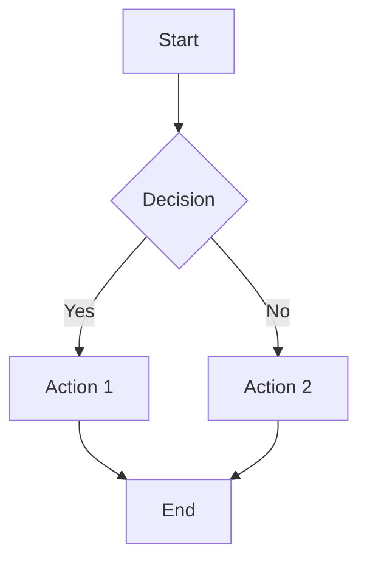

# Markdown - Lightweight Markup Language

Markdown is a lightweight markup language with plain text formatting syntax designed to be easily readable and writable. It's widely used for documentation, README files, and content creation across development platforms.

## Syntax Reference

### Headers
```markdown
# H1 Header
## H2 Header
### H3 Header
#### H4 Header
##### H5 Header
###### H6 Header

Alternative H1
==============

Alternative H2
--------------
```

### Text Formatting
```markdown
**Bold text** or __Bold text__
*Italic text* or _Italic text_
***Bold and italic*** or ___Bold and italic___
~~Strikethrough text~~
`Inline code`
```

### Lists
```markdown
# Unordered List
- Item 1
- Item 2
  - Nested item 2.1
  - Nested item 2.2
- Item 3

# Alternative bullets
* Item 1
+ Item 2

# Ordered List
1. First item
2. Second item
   1. Nested item 2.1
   2. Nested item 2.2
3. Third item

# Task List (GitHub Flavored Markdown)
- [x] Completed task
- [ ] Incomplete task
- [x] Another completed task
```

### Links and Images
```markdown
# Links
[Link text](https://example.com)
[Link with title](https://example.com "Title text")
[Reference link][reference-id]

# Images


![Reference image][image-ref]

# Reference definitions (usually at bottom of document)
[reference-id]: https://example.com
[image-ref]: image.jpg "Image title"

# Auto-links
<https://example.com>
<email@example.com>
```

### Code Blocks
````markdown
# Inline code
Use `console.log()` to print output.

# Fenced code blocks
```javascript
function hello() {
    console.log("Hello, World!");
}
```

# Code block with syntax highlighting
```python
def fibonacci(n):
    if n <= 1:
        return n
    return fibonacci(n-1) + fibonacci(n-2)
```

# Indented code blocks (4 spaces or 1 tab)
    function example() {
        return "This is code";
    }
````

### Tables
```markdown
| Header 1 | Header 2 | Header 3 |
|----------|----------|----------|
| Cell 1   | Cell 2   | Cell 3   |
| Cell 4   | Cell 5   | Cell 6   |

# Alignment
| Left | Center | Right |
|:-----|:------:|------:|
| L1   |   C1   |    R1 |
| L2   |   C2   |    R2 |

# Minimal tables
Header 1 | Header 2
---------|----------
Cell 1   | Cell 2
Cell 3   | Cell 4
```

### Blockquotes
```markdown
> This is a blockquote.
> It can span multiple lines.

> Nested blockquotes
>> are also possible

> **Markdown** works *inside* blockquotes
> 
> Even with multiple paragraphs
```

### Horizontal Rules
```markdown
---

***

___

- - -

* * *
```

## Extended Syntax (CommonMark and GitHub Flavored Markdown)

### Footnotes
```markdown
Here's a sentence with a footnote[^1].

Here's another footnote[^note].

[^1]: This is the first footnote.
[^note]: This is a named footnote.
```

### Definition Lists
```markdown
Term 1
:   Definition 1

Term 2
:   Definition 2a
:   Definition 2b
```

### Abbreviations
```markdown
*[HTML]: HyperText Markup Language
*[W3C]:  World Wide Web Consortium

The HTML specification is maintained by the W3C.
```

### Math (KaTeX/MathJax)
```markdown
Inline math: $E = mc^2$

Block math:
$$
\int_{-\infty}^{\infty} e^{-x^2} dx = \sqrt{\pi}
$$
```

### Mermaid Diagrams
````markdown

````

## Markdown Processing

### Python with markdown library
```python
import markdown
from markdown.extensions import codehilite, toc

# Basic conversion
md = markdown.Markdown()
html = md.convert("# Hello World\n\nThis is **bold** text.")

# With extensions
md = markdown.Markdown(extensions=[
    'markdown.extensions.extra',
    'markdown.extensions.codehilite',
    'markdown.extensions.toc',
    'markdown.extensions.tables',
    'markdown.extensions.fenced_code'
])

with open('document.md', 'r') as f:
    text = f.read()

html = md.convert(text)

# Save to HTML file
with open('document.html', 'w') as f:
    f.write(f"""
<!DOCTYPE html>
<html>
<head>
    <title>Document</title>
    <link rel="stylesheet" href="https://cdnjs.cloudflare.com/ajax/libs/github-markdown-css/4.0.0/github-markdown.min.css">
</head>
<body>
    <div class="markdown-body">
        {html}
    </div>
</body>
</html>
""")
```

### Custom Markdown Extensions
```python
from markdown.extensions import Extension
from markdown.preprocessors import Preprocessor
from markdown.postprocessors import Postprocessor
import re

class CustomExtension(Extension):
    def extendMarkdown(self, md):
        # Add custom preprocessor
        md.preprocessors.register(
            AlertPreprocessor(md), 'alert', 175
        )
        
        # Add custom postprocessor
        md.postprocessors.register(
            CustomPostprocessor(md), 'custom', 175
        )

class AlertPreprocessor(Preprocessor):
    def run(self, lines):
        """Convert alert syntax to HTML"""
        new_lines = []
        in_alert = False
        
        for line in lines:
            if line.startswith('!!! '):
                # Start alert block
                alert_type = line[4:].strip()
                new_lines.append(f'<div class="alert alert-{alert_type}">')
                in_alert = True
            elif in_alert and line.strip() == '':
                # End alert block
                new_lines.append('</div>')
                new_lines.append(line)
                in_alert = False
            else:
                new_lines.append(line)
        
        return new_lines

class CustomPostprocessor(Postprocessor):
    def run(self, text):
        """Add custom processing after HTML generation"""
        # Add CSS classes to tables
        text = re.sub(r'<table>', '<table class="table table-striped">', text)
        return text

# Usage
md = markdown.Markdown(extensions=[CustomExtension()])
```

### Markdown to PDF
```python
import markdown
import pdfkit
from weasyprint import HTML, CSS

def markdown_to_pdf_pdfkit(md_file, pdf_file):
    """Convert Markdown to PDF using pdfkit"""
    with open(md_file, 'r') as f:
        md_content = f.read()
    
    # Convert to HTML
    md = markdown.Markdown(extensions=['extra', 'codehilite'])
    html_content = md.convert(md_content)
    
    # Wrap in complete HTML document
    full_html = f"""
    <!DOCTYPE html>
    <html>
    <head>
        <meta charset="UTF-8">
        <style>
            body {{ font-family: Arial, sans-serif; margin: 40px; }}
            pre {{ background: #f4f4f4; padding: 10px; border-radius: 5px; }}
            code {{ background: #f4f4f4; padding: 2px 4px; border-radius: 3px; }}
            blockquote {{ border-left: 4px solid #ddd; margin: 0; padding-left: 20px; }}
        </style>
    </head>
    <body>
        {html_content}
    </body>
    </html>
    """
    
    # Convert to PDF
    pdfkit.from_string(full_html, pdf_file)

def markdown_to_pdf_weasyprint(md_file, pdf_file):
    """Convert Markdown to PDF using WeasyPrint"""
    with open(md_file, 'r') as f:
        md_content = f.read()
    
    md = markdown.Markdown(extensions=['extra', 'codehilite'])
    html_content = md.convert(md_content)
    
    # Create CSS for styling
    css = CSS(string='''
        @page {
            margin: 2cm;
            size: A4;
        }
        body {
            font-family: "Helvetica", sans-serif;
            font-size: 12pt;
            line-height: 1.6;
        }
        h1, h2, h3, h4, h5, h6 {
            color: #333;
            page-break-after: avoid;
        }
        pre {
            background: #f5f5f5;
            padding: 10px;
            border-radius: 5px;
            page-break-inside: avoid;
        }
        blockquote {
            border-left: 4px solid #ddd;
            margin: 0;
            padding-left: 20px;
            font-style: italic;
        }
        table {
            border-collapse: collapse;
            width: 100%;
            page-break-inside: avoid;
        }
        table, th, td {
            border: 1px solid #ddd;
        }
        th, td {
            padding: 8px;
            text-align: left;
        }
    ''')
    
    HTML(string=html_content).write_pdf(pdf_file, stylesheets=[css])

# Usage
markdown_to_pdf_pdfkit('document.md', 'document.pdf')
```

## Documentation Workflows

### Documentation Site Generator
```python
#!/usr/bin/env python3
import os
import markdown
import jinja2
from pathlib import Path
import yaml
import shutil

class MarkdownSiteGenerator:
    def __init__(self, source_dir, output_dir, template_dir):
        self.source_dir = Path(source_dir)
        self.output_dir = Path(output_dir)
        self.template_dir = Path(template_dir)
        
        # Setup Jinja2 environment
        self.jinja_env = jinja2.Environment(
            loader=jinja2.FileSystemLoader(str(self.template_dir))
        )
        
        # Setup Markdown processor
        self.md = markdown.Markdown(extensions=[
            'markdown.extensions.extra',
            'markdown.extensions.codehilite',
            'markdown.extensions.toc',
            'markdown.extensions.meta'
        ])
    
    def load_config(self):
        """Load site configuration"""
        config_file = self.source_dir / 'config.yml'
        if config_file.exists():
            with open(config_file, 'r') as f:
                return yaml.safe_load(f)
        return {}
    
    def process_markdown_file(self, md_file):
        """Process a single markdown file"""
        with open(md_file, 'r', encoding='utf-8') as f:
            content = f.read()
        
        # Convert to HTML
        html_content = self.md.convert(content)
        
        # Extract metadata
        meta = getattr(self.md, 'Meta', {})
        
        # Build page data
        page_data = {
            'content': html_content,
            'title': meta.get('title', [md_file.stem])[0] if meta.get('title') else md_file.stem,
            'toc': self.md.toc if hasattr(self.md, 'toc') else '',
            'meta': meta
        }
        
        return page_data
    
    def build_navigation(self):
        """Build site navigation"""
        nav = []
        
        for md_file in self.source_dir.rglob('*.md'):
            if md_file.name.startswith('_'):
                continue
                
            relative_path = md_file.relative_to(self.source_dir)
            html_path = relative_path.with_suffix('.html')
            
            nav.append({
                'title': md_file.stem.replace('_', ' ').title(),
                'path': str(html_path),
                'level': len(relative_path.parts) - 1
            })
        
        return sorted(nav, key=lambda x: x['path'])
    
    def generate_site(self):
        """Generate the complete site"""
        config = self.load_config()
        navigation = self.build_navigation()
        
        # Create output directory
        self.output_dir.mkdir(parents=True, exist_ok=True)
        
        # Copy static files
        static_dir = self.source_dir / 'static'
        if static_dir.exists():
            shutil.copytree(static_dir, self.output_dir / 'static', dirs_exist_ok=True)
        
        # Process all markdown files
        for md_file in self.source_dir.rglob('*.md'):
            if md_file.name.startswith('_'):
                continue
            
            # Process markdown
            page_data = self.process_markdown_file(md_file)
            
            # Prepare template context
            context = {
                'page': page_data,
                'navigation': navigation,
                'config': config
            }
            
            # Render template
            template = self.jinja_env.get_template('page.html')
            html_output = template.render(context)
            
            # Write output file
            relative_path = md_file.relative_to(self.source_dir)
            output_file = self.output_dir / relative_path.with_suffix('.html')
            output_file.parent.mkdir(parents=True, exist_ok=True)
            
            with open(output_file, 'w', encoding='utf-8') as f:
                f.write(html_output)
            
            print(f"Generated: {output_file}")

# Template example (templates/page.html)
page_template = """
<!DOCTYPE html>
<html lang="en">
<head>
    <meta charset="UTF-8">
    <meta name="viewport" content="width=device-width, initial-scale=1.0">
    <title>{{ page.title }} - {{ config.site_name or 'Documentation' }}</title>
    <link rel="stylesheet" href="/static/style.css">
    <link rel="stylesheet" href="https://cdnjs.cloudflare.com/ajax/libs/highlight.js/11.3.1/styles/default.min.css">
</head>
<body>
    <nav class="sidebar">
        <h3>{{ config.site_name or 'Documentation' }}</h3>
        <ul>
        
            <li class="nav-level-{{ item.level }}">
                <a href="/{{ item.path }}">{{ item.title }}</a>
            </li>
        
        </ul>
    </nav>
    
    <main class="content">
        <header>
            <h1>{{ page.title }}</h1>
        </header>
        
        
        <aside class="toc">
            <h3>Table of Contents</h3>
            {{ page.toc|safe }}
        </aside>
        
        
        <article>
            {{ page.content|safe }}
        </article>
    </main>
    
    <script src="https://cdnjs.cloudflare.com/ajax/libs/highlight.js/11.3.1/highlight.min.js"></script>
    <script>hljs.highlightAll();</script>
</body>
</html>
"""

# Usage
generator = MarkdownSiteGenerator('docs', 'dist', 'templates')
generator.generate_site()
```

### Live Preview Server
```python
#!/usr/bin/env python3
import os
import time
from http.server import HTTPServer, SimpleHTTPRequestHandler
from watchdog.observers import Observer
from watchdog.events import FileSystemEventHandler
import threading
import webbrowser

class MarkdownHandler(FileSystemEventHandler):
    def __init__(self, generator):
        self.generator = generator
        self.last_rebuild = 0
    
    def on_modified(self, event):
        if event.is_directory:
            return
        
        if event.src_path.endswith('.md') or event.src_path.endswith('.yml'):
            # Debounce rebuilds
            now = time.time()
            if now - self.last_rebuild > 1:
                print(f"File changed: {event.src_path}")
                self.generator.generate_site()
                self.last_rebuild = now

class LivePreviewServer:
    def __init__(self, source_dir, output_dir, template_dir, port=8000):
        self.source_dir = source_dir
        self.output_dir = output_dir
        self.port = port
        
        self.generator = MarkdownSiteGenerator(source_dir, output_dir, template_dir)
        
    def start(self):
        """Start the live preview server"""
        # Initial build
        print("Building site...")
        self.generator.generate_site()
        
        # Setup file watcher
        event_handler = MarkdownHandler(self.generator)
        observer = Observer()
        observer.schedule(event_handler, self.source_dir, recursive=True)
        observer.start()
        
        # Setup HTTP server
        os.chdir(self.output_dir)
        httpd = HTTPServer(('localhost', self.port), SimpleHTTPRequestHandler)
        
        print(f"Server running at http://localhost:{self.port}")
        print("Watching for changes...")
        
        # Open browser
        webbrowser.open(f'http://localhost:{self.port}')
        
        try:
            httpd.serve_forever()
        except KeyboardInterrupt:
            print("\nShutting down...")
            observer.stop()
            httpd.shutdown()
        
        observer.join()

# Usage
if __name__ == '__main__':
    server = LivePreviewServer('docs', 'dist', 'templates')
    server.start()
```

## Integration with Development Tools

### Git Hooks for Documentation
```bash
#!/bin/bash
# .git/hooks/pre-commit

# Check for broken markdown links
echo "Checking markdown links..."
python3 scripts/check-markdown-links.py

if [ $? -ne 0 ]; then
    echo "❌ Broken links found in markdown files"
    exit 1
fi

# Validate markdown syntax
echo "Validating markdown syntax..."
find docs -name "*.md" -exec markdown-lint {} \;

if [ $? -ne 0 ]; then
    echo "❌ Markdown syntax errors found"
    exit 1
fi

echo "✅ Documentation checks passed"
```

```python
# scripts/check-markdown-links.py
#!/usr/bin/env python3
import re
import os
import requests
from pathlib import Path
import urllib.parse

def extract_links(content):
    """Extract all links from markdown content"""
    # Match [text](url) format
    links = re.findall(r'\[([^\]]*)\]\(([^)]+)\)', content)
    return [(text, url) for text, url in links]

def check_internal_link(link, base_path):
    """Check if internal link exists"""
    if link.startswith('#'):
        return True  # Skip anchor links for now
    
    if link.startswith('/'):
        link = link[1:]  # Remove leading slash
    
    file_path = base_path / link
    
    # Check if file exists
    if file_path.exists():
        return True
    
    # Check with .md extension
    if file_path.with_suffix('.md').exists():
        return True
    
    return False

def check_external_link(url):
    """Check if external link is accessible"""
    try:
        response = requests.head(url, timeout=10, allow_redirects=True)
        return response.status_code < 400
    except:
        return False

def check_markdown_file(file_path):
    """Check all links in a markdown file"""
    with open(file_path, 'r', encoding='utf-8') as f:
        content = f.read()
    
    links = extract_links(content)
    broken_links = []
    
    for text, url in links:
        if url.startswith('http'):
            # External link
            if not check_external_link(url):
                broken_links.append((text, url, 'External link not accessible'))
        else:
            # Internal link
            if not check_internal_link(url, file_path.parent):
                broken_links.append((text, url, 'Internal link not found'))
    
    return broken_links

def main():
    docs_dir = Path('docs')
    total_broken = 0
    
    for md_file in docs_dir.rglob('*.md'):
        broken_links = check_markdown_file(md_file)
        
        if broken_links:
            print(f"\n❌ {md_file}:")
            for text, url, reason in broken_links:
                print(f"  - [{text}]({url}) - {reason}")
            total_broken += len(broken_links)
    
    if total_broken > 0:
        print(f"\n❌ Found {total_broken} broken links")
        exit(1)
    else:
        print("✅ All links are valid")

if __name__ == '__main__':
    main()
```

### VS Code Integration
```json
// .vscode/settings.json
{
    "markdown.preview.fontSize": 14,
    "markdown.preview.lineHeight": 1.6,
    "markdown.preview.scrollPreviewWithEditor": true,
    "markdown.preview.markEditorSelection": true,
    "markdown.preview.scrollEditorWithPreview": true,
    "markdown.extension.toc.levels": "2..6",
    "markdown.extension.preview.autoShowPreviewToSide": false,
    "markdown.extension.orderedList.marker": "ordered",
    "markdown.extension.italic.indicator": "*",
    "markdown.extension.bold.indicator": "**",
    "files.associations": {
        "*.md": "markdown"
    },
    "editor.defaultFormatter": "DavidAnson.vscode-markdownlint",
    "[markdown]": {
        "editor.wordWrap": "on",
        "editor.quickSuggestions": {
            "comments": "off",
            "strings": "off",
            "other": "off"
        }
    }
}
```

```json
// .markdownlint.json
{
    "MD003": { "style": "atx" },
    "MD007": { "indent": 2 },
    "MD013": { "line_length": 100 },
    "MD022": false,
    "MD024": { "allow_different_nesting": true },
    "MD033": { "allowed_elements": ["div", "span", "br", "sub", "sup"] },
    "MD034": false,
    "MD041": false
}
```

## Best Practices

### Content Organization
- Use consistent heading hierarchy
- Keep paragraphs concise and focused
- Use descriptive link text
- Include table of contents for long documents
- Organize content with logical file structure

### Writing Style
- Write in clear, simple language
- Use active voice when possible
- Break up long content with subheadings
- Include code examples where relevant
- Use bullet points for lists of items

### Technical Documentation
- Include prerequisite information
- Provide step-by-step instructions
- Use consistent formatting for code
- Include expected outputs and error scenarios
- Maintain up-to-date screenshots and examples

### Maintenance
- Regular link checking and validation
- Version control for documentation
- Automated testing of code examples
- Review and update documentation with code changes
- Archive or redirect outdated content

## Tools and Ecosystem

### Popular Markdown Processors
- **CommonMark**: Standard specification implementation
- **GitHub Flavored Markdown (GFM)**: Extended syntax with tables, task lists
- **Pandoc**: Universal document converter
- **markdown-it**: JavaScript parser with plugin ecosystem
- **Python-Markdown**: Extensible Python implementation

### Documentation Generators
- **MkDocs**: Python-based static site generator
- **GitBook**: Modern documentation platform
- **Docusaurus**: Facebook's documentation platform
- **VuePress**: Vue.js powered static site generator
- **Sphinx**: Python documentation generator with Markdown support

### Editor Support
- **Typora**: WYSIWYG markdown editor
- **Mark Text**: Real-time preview editor
- **Zettlr**: Academic writing focused
- **Obsidian**: Knowledge management with markdown
- **Notable**: Note-taking with markdown support

## Resources

- [CommonMark Specification](https://commonmark.org/)
- [GitHub Flavored Markdown Spec](https://github.github.com/gfm/)
- [Markdown Guide](https://www.markdownguide.org/)
- [Awesome Markdown](https://github.com/mundimark/awesome-markdown)
- [Markdown Test Suite](https://github.com/karlcow/markdown-testsuite)