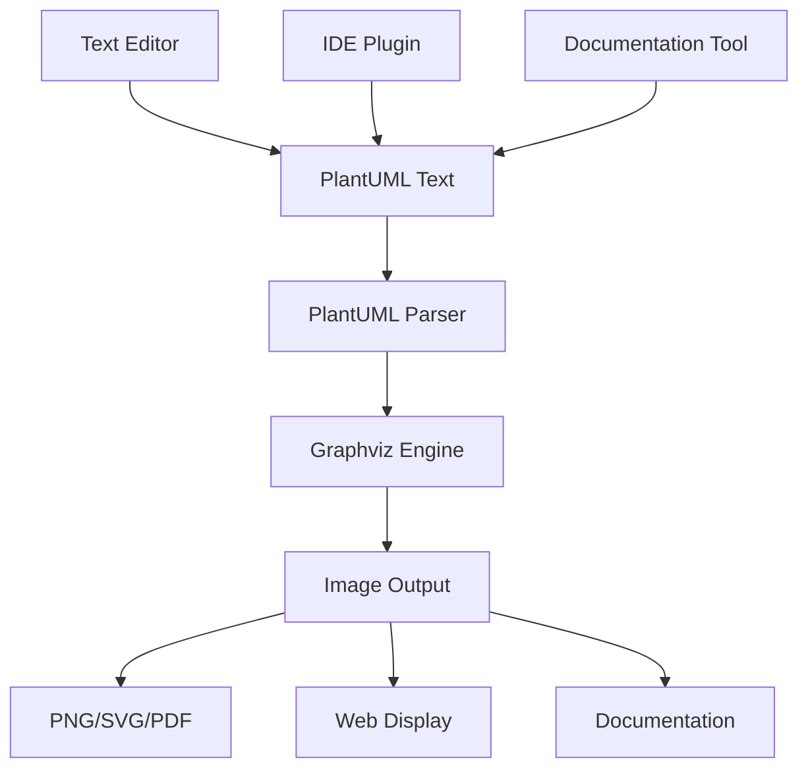
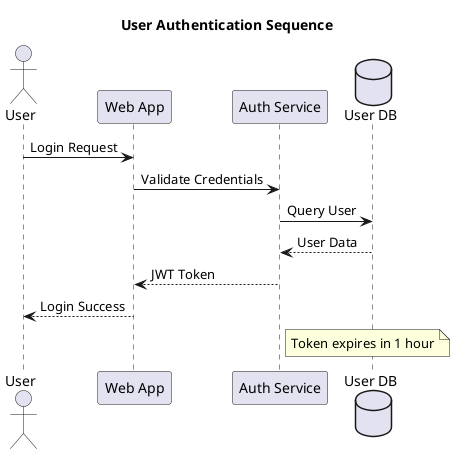
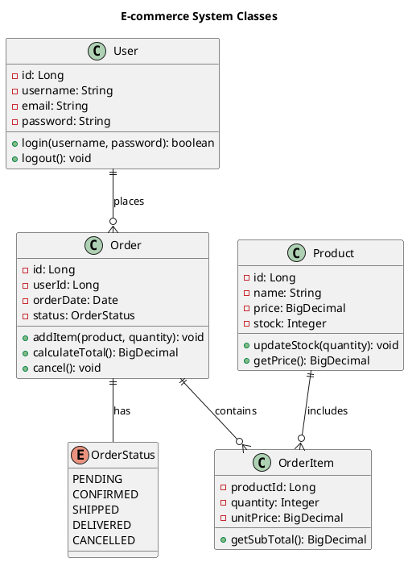
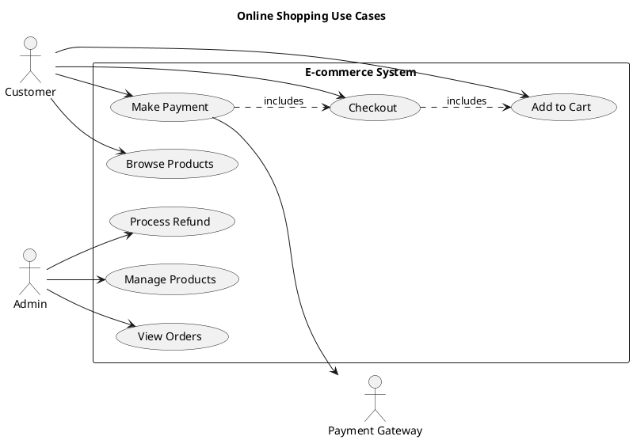
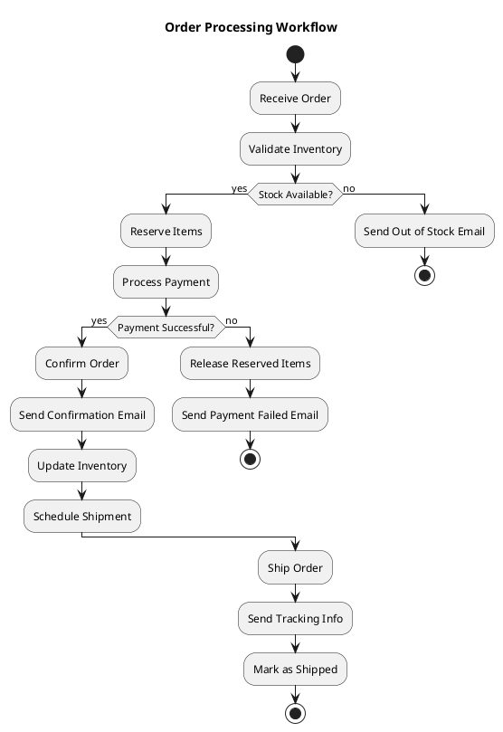
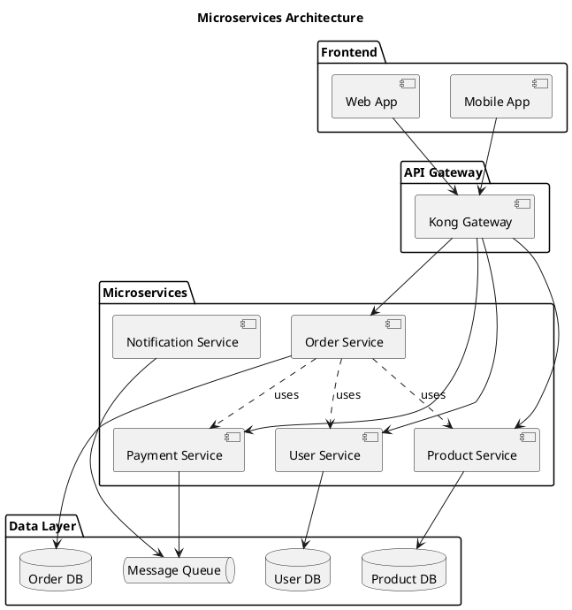
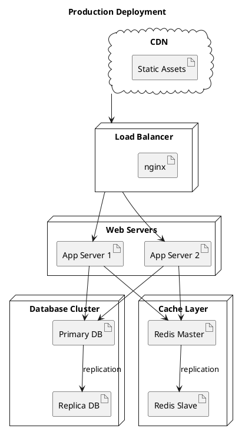
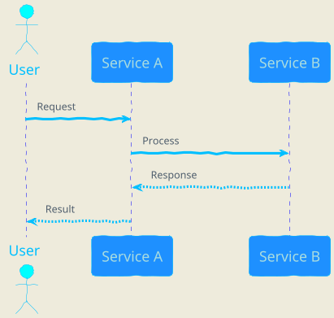
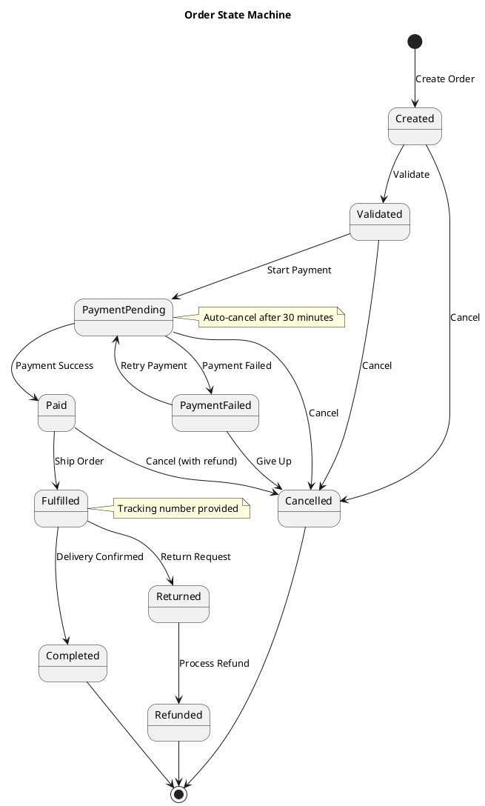
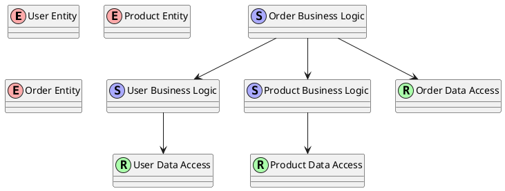

# PlantUML - Text-based UML Diagram Generator

PlantUML is an open-source tool that allows users to create UML diagrams from plain text descriptions. It supports various diagram types and can be integrated into documentation workflows, IDEs, and CI/CD pipelines.

## Architecture



## Installation

### Java Application
```bash
# Download PlantUML JAR
wget https://github.com/plantuml/plantuml/releases/latest/download/plantuml.jar

# Run PlantUML
java -jar plantuml.jar diagram.puml

# With GUI
java -jar plantuml.jar -gui
```

### Package Managers
```bash
# Ubuntu/Debian
sudo apt update && sudo apt install plantuml

# macOS
brew install plantuml

# Windows (Chocolatey)
choco install plantuml

# Docker
docker run --rm -v $(pwd):/data plantuml/plantuml diagram.puml
```

### Node.js Integration
```bash
npm install -g node-plantuml-cli

# Usage
puml generate diagram.puml
```

## Basic Syntax

### Sequence Diagrams


### Class Diagrams


### Use Case Diagrams


### Activity Diagrams


### Component Diagrams


### Deployment Diagrams


## Advanced Features

### Custom Colors and Styling


### Including Files and Libraries
```plantuml
@startuml
!include https://raw.githubusercontent.com/plantuml-stdlib/C4-PlantUML/master/C4_Container.puml

title Container Diagram for Internet Banking System

Person(customer, "Customer", "A customer of the bank")
System_Boundary(c1, "Internet Banking") {
    Container(web_app, "Web Application", "Java, Spring MVC", "Provides banking functionality via web browser")
    Container(spa, "Single-Page App", "JavaScript, Angular", "Provides banking functionality")
    Container(mobile_app, "Mobile App", "Xamarin", "Provides banking functionality")
    Container(api, "API Application", "Java, Spring Boot", "Provides banking functionality via API")
    ContainerDb(database, "Database", "Oracle Database Schema", "Stores user registrations, hashed auth credentials, access logs, etc.")
}

System_Ext(email_system, "E-Mail System", "The internal Microsoft Exchange e-mail system")
System_Ext(banking_system, "Mainframe Banking System", "Stores all of the core banking information")

Rel(customer, web_app, "Uses", "HTTPS")
Rel(customer, spa, "Uses", "HTTPS")
Rel(customer, mobile_app, "Uses")

Rel_Neighbor(web_app, spa, "Delivers")
Rel(spa, api, "Uses", "async, JSON/HTTPS")
Rel(mobile_app, api, "Uses", "async, JSON/HTTPS")
Rel_Back_Neighbor(database, api, "Reads from and writes to", "sync, JDBC")

Rel_Back(customer, email_system, "Sends e-mails to")
Rel_Back(email_system, api, "Sends e-mails using", "sync, SMTP")
Rel_Neighbor(api, banking_system, "Uses", "sync/async, XML/HTTPS")
@enduml
```

### State Diagrams


## Integration Examples

### Python Integration
```python
#!/usr/bin/env python3
import subprocess
import os
from pathlib import Path

class PlantUMLGenerator:
    def __init__(self, plantuml_jar_path=None):
        self.plantuml_jar = plantuml_jar_path or "plantuml.jar"
    
    def generate_diagram(self, puml_content, output_file, format='png'):
        """Generate diagram from PlantUML content"""
        # Create temporary .puml file
        temp_puml = f"{output_file.stem}.puml"
        
        with open(temp_puml, 'w') as f:
            f.write(puml_content)
        
        try:
            # Run PlantUML
            cmd = [
                'java', '-jar', self.plantuml_jar,
                f'-t{format}',
                f'-o{output_file.parent}',
                temp_puml
            ]
            
            result = subprocess.run(cmd, capture_output=True, text=True)
            
            if result.returncode == 0:
                print(f"Generated: {output_file}")
                return True
            else:
                print(f"Error: {result.stderr}")
                return False
                
        finally:
            # Cleanup temp file
            if os.path.exists(temp_puml):
                os.remove(temp_puml)
    
    def generate_from_file(self, puml_file, output_dir=None, format='png'):
        """Generate diagram from .puml file"""
        puml_path = Path(puml_file)
        output_dir = Path(output_dir) if output_dir else puml_path.parent
        
        cmd = [
            'java', '-jar', self.plantuml_jar,
            f'-t{format}',
            f'-o{output_dir}',
            str(puml_path)
        ]
        
        result = subprocess.run(cmd, capture_output=True, text=True)
        return result.returncode == 0

# Example usage
generator = PlantUMLGenerator()

# Generate sequence diagram
sequence_diagram = """
@startuml
actor User
participant API
participant Database

User -> API: GET /users
API -> Database: SELECT * FROM users
Database --> API: User data
API --> User: JSON response
@enduml
"""

generator.generate_diagram(sequence_diagram, Path("sequence.png"))
```

### Markdown Documentation Integration
```python
#!/usr/bin/env python3
import re
import os
from pathlib import Path
import markdown
from plantuml_generator import PlantUMLGenerator

class MarkdownPlantUMLProcessor:
    def __init__(self, plantuml_generator):
        self.plantuml = plantuml_generator
        self.diagram_counter = 0
    
    def process_markdown_file(self, md_file, output_dir):
        """Process markdown file and generate PlantUML diagrams"""
        with open(md_file, 'r') as f:
            content = f.read()
        
        # Find PlantUML code blocks
        pattern = r'```plantuml\n(.*?)\n```'
        matches = re.finditer(pattern, content, re.DOTALL)
        
        processed_content = content
        
        for match in matches:
            puml_content = match.group(1)
            
            # Generate unique filename
            self.diagram_counter += 1
            diagram_name = f"diagram_{self.diagram_counter}.png"
            diagram_path = Path(output_dir) / diagram_name
            
            # Generate diagram
            full_puml = f"@startuml\n{puml_content}\n@enduml"
            if self.plantuml.generate_diagram(full_puml, diagram_path):
                # Replace code block with image
                img_tag = f""
                processed_content = processed_content.replace(match.group(0), img_tag)
        
        return processed_content
    
    def process_directory(self, source_dir, output_dir):
        """Process all markdown files in directory"""
        source_path = Path(source_dir)
        output_path = Path(output_dir)
        output_path.mkdir(parents=True, exist_ok=True)
        
        for md_file in source_path.rglob('*.md'):
            print(f"Processing: {md_file}")
            
            processed_content = self.process_markdown_file(md_file, output_path)
            
            # Write processed markdown
            output_file = output_path / md_file.name
            with open(output_file, 'w') as f:
                f.write(processed_content)
            
            # Convert to HTML
            md = markdown.Markdown(extensions=['extra', 'codehilite'])
            html_content = md.convert(processed_content)
            
            html_file = output_path / f"{md_file.stem}.html"
            with open(html_file, 'w') as f:
                f.write(f"""
<!DOCTYPE html>
<html>
<head>
    <title>{md_file.stem}</title>
    <style>
        body {{ font-family: Arial, sans-serif; margin: 40px; }}
        img {{ max-width: 100%; height: auto; }}
        pre {{ background: #f4f4f4; padding: 10px; border-radius: 5px; }}
    </style>
</head>
<body>
    {html_content}
</body>
</html>
                """)

# Usage
generator = PlantUMLGenerator()
processor = MarkdownPlantUMLProcessor(generator)
processor.process_directory('docs', 'output')
```

### Web Service Integration
```python
#!/usr/bin/env python3
from flask import Flask, request, jsonify, send_file
import base64
import zlib
import io
from plantuml_generator import PlantUMLGenerator

app = Flask(__name__)
generator = PlantUMLGenerator()

def encode_plantuml_url(plantuml_text):
    """Encode PlantUML text for URL"""
    compressed = zlib.compress(plantuml_text.encode('utf-8'))
    encoded = base64.b64encode(compressed).decode('ascii')
    # PlantUML URL encoding
    url_encoded = encoded.translate(str.maketrans('+/=', '-_~'))
    return url_encoded

@app.route('/generate', methods=['POST'])
def generate_diagram():
    """Generate diagram from PlantUML text"""
    data = request.json
    puml_content = data.get('plantuml', '')
    format = data.get('format', 'png')
    
    if not puml_content:
        return jsonify({'error': 'PlantUML content required'}), 400
    
    # Generate diagram in memory
    temp_file = f"temp_diagram.{format}"
    
    if generator.generate_diagram(puml_content, Path(temp_file), format):
        try:
            return send_file(temp_file, as_attachment=True)
        finally:
            if os.path.exists(temp_file):
                os.remove(temp_file)
    else:
        return jsonify({'error': 'Failed to generate diagram'}), 500

@app.route('/url/<encoded_plantuml>')
def serve_diagram_from_url(encoded_plantuml):
    """Serve diagram from encoded URL"""
    try:
        # Decode PlantUML from URL
        decoded = encoded_plantuml.translate(str.maketrans('-_~', '+/='))
        compressed = base64.b64decode(decoded)
        plantuml_text = zlib.decompress(compressed).decode('utf-8')
        
        # Generate diagram
        temp_file = "url_diagram.png"
        if generator.generate_diagram(plantuml_text, Path(temp_file)):
            try:
                return send_file(temp_file)
            finally:
                if os.path.exists(temp_file):
                    os.remove(temp_file)
        else:
            return "Failed to generate diagram", 500
            
    except Exception as e:
        return f"Error decoding PlantUML: {str(e)}", 400

@app.route('/validate', methods=['POST'])
def validate_plantuml():
    """Validate PlantUML syntax"""
    data = request.json
    puml_content = data.get('plantuml', '')
    
    # Try to generate diagram to validate
    temp_file = "validate.png"
    is_valid = generator.generate_diagram(puml_content, Path(temp_file))
    
    if os.path.exists(temp_file):
        os.remove(temp_file)
    
    return jsonify({'valid': is_valid})

if __name__ == '__main__':
    app.run(debug=True, port=5000)
```

## CI/CD Integration

### GitHub Actions
```yaml
# .github/workflows/plantuml-docs.yml
name: Generate PlantUML Diagrams

on:
  push:
    branches: [main]
    paths: ['docs/**/*.puml', 'docs/**/*.md']

jobs:
  generate-diagrams:
    runs-on: ubuntu-latest
    
    steps:
    - uses: actions/checkout@v3
    
    - name: Setup Java
      uses: actions/setup-java@v3
      with:
        distribution: 'temurin'
        java-version: '11'
    
    - name: Install PlantUML
      run: |
        wget https://github.com/plantuml/plantuml/releases/latest/download/plantuml.jar
        sudo mv plantuml.jar /usr/local/bin/
    
    - name: Generate diagrams
      run: |
        find docs -name "*.puml" -exec java -jar /usr/local/bin/plantuml.jar {} \;
        find docs -name "*.md" -exec python3 scripts/process-markdown-plantuml.py {} \;
    
    - name: Commit generated diagrams
      run: |
        git config --local user.email "action@github.com"
        git config --local user.name "GitHub Action"
        git add docs/**/*.png docs/**/*.svg
        git diff --staged --quiet || git commit -m "Auto-generate PlantUML diagrams"
        git push
```

### Docker Integration
```dockerfile
# Dockerfile.plantuml
FROM openjdk:11-jre-slim

# Install dependencies
RUN apt-get update && apt-get install -y \
    wget \
    graphviz \
    && rm -rf /var/lib/apt/lists/*

# Download PlantUML
RUN wget https://github.com/plantuml/plantuml/releases/latest/download/plantuml.jar \
    -O /usr/local/bin/plantuml.jar

# Create script
RUN echo '#!/bin/bash\njava -jar /usr/local/bin/plantuml.jar "$@"' > /usr/local/bin/plantuml \
    && chmod +x /usr/local/bin/plantuml

WORKDIR /diagrams
ENTRYPOINT ["plantuml"]
```

```yaml
# docker-compose.yml for documentation pipeline
version: '3.8'
services:
  plantuml-generator:
    build:
      context: .
      dockerfile: Dockerfile.plantuml
    volumes:
      - ./docs:/diagrams
    command: ["*.puml", "-tpng"]
  
  docs-server:
    image: nginx:alpine
    ports:
      - "8080:80"
    volumes:
      - ./docs:/usr/share/nginx/html:ro
    depends_on:
      - plantuml-generator
```

### Jenkins Pipeline
```groovy
pipeline {
    agent any
    
    stages {
        stage('Generate Diagrams') {
            steps {
                sh '''
                    # Install PlantUML if not exists
                    if [ ! -f plantuml.jar ]; then
                        wget https://github.com/plantuml/plantuml/releases/latest/download/plantuml.jar
                    fi
                    
                    # Generate all diagrams
                    find docs -name "*.puml" -exec java -jar plantuml.jar {} \\;
                    
                    # Process markdown files
                    python3 scripts/process-plantuml-docs.py
                '''
            }
        }
        
        stage('Deploy Documentation') {
            steps {
                sh '''
                    # Copy to web server
                    rsync -av docs/ user@webserver:/var/www/docs/
                '''
            }
        }
    }
    
    post {
        always {
            archiveArtifacts artifacts: 'docs/**/*.png', allowEmptyArchive: true
        }
    }
}
```

## Advanced Configuration

### Custom Themes
```plantuml
@startuml
!theme vibrant

' Custom color definitions
!define TECH_COLOR #FF6B6B
!define DATA_COLOR #4ECDC4
!define USER_COLOR #45B7D1
!define PROCESS_COLOR #96CEB4

skinparam backgroundColor white
skinparam shadowing false
skinparam roundCorner 15

skinparam activity {
    BackgroundColor PROCESS_COLOR
    BorderColor black
    FontColor black
    FontSize 12
}

skinparam actor {
    BackgroundColor USER_COLOR
    BorderColor black
    FontColor white
}

actor User #USER_COLOR
participant "Web App" as WA #TECH_COLOR
database "Database" as DB #DATA_COLOR

User -> WA: Request
WA -> DB: Query
DB --> WA: Data
WA --> User: Response
@enduml
```

### Include Libraries
```plantuml
@startuml
!include <office/Users/user.puml>
!include <office/Services/database.puml>
!include <office/Servers/application_server.puml>

title System Architecture with Office Icons

<$user> as user
<$application_server> as app
<$database> as db

user --> app : HTTP Request
app --> db : SQL Query
db --> app : Result Set
app --> user : JSON Response
@enduml
```

### Macros and Functions


## Best Practices

### Diagram Organization
- Use meaningful titles and descriptions
- Keep diagrams focused on single concepts
- Break complex diagrams into multiple views
- Use consistent naming conventions
- Include legends for complex symbols

### Code Organization
```plantuml
' File: common/styles.puml
@startuml
!define PRIMARY_COLOR #2196F3
!define SECONDARY_COLOR #FFC107
!define SUCCESS_COLOR #4CAF50
!define ERROR_COLOR #F44336

skinparam class {
    BackgroundColor PRIMARY_COLOR
    BorderColor black
    FontColor white
}
@enduml
```

```plantuml
' File: diagrams/user-flow.puml
@startuml
!include common/styles.puml

title User Registration Flow

start
:User visits registration page;
:Fill registration form;
:Submit form;

if (Valid data?) then (yes)
    :Create user account;
    :Send confirmation email;
    :Redirect to login;
else (no)
    :Show validation errors;
    :Return to form;
endif

stop
@enduml
```

### Documentation Integration
- Embed diagrams in markdown documentation
- Use version control for .puml source files
- Automate diagram generation in CI/CD
- Maintain diagram-to-code consistency
- Regular reviews and updates

### Performance Optimization
- Use `!pragma` directives for large diagrams
- Limit diagram complexity (max 20-30 elements)
- Consider splitting into multiple diagrams
- Use external includes for common elements
- Optimize image formats (SVG for web, PNG for documents)

## Troubleshooting

### Common Issues

**Java Memory Issues**
```bash
# Increase Java heap size
java -Xmx2g -jar plantuml.jar diagram.puml

# For very large diagrams
java -Xmx4g -XX:+UseG1GC -jar plantuml.jar diagram.puml
```

**Font Issues**
```plantuml
@startuml
skinparam defaultFontName Arial
skinparam defaultFontSize 12

' Or use system fonts
skinparam classFontName "DejaVu Sans"
@enduml
```

**Graphviz Errors**
```bash
# Install Graphviz
sudo apt install graphviz

# macOS
brew install graphviz

# Verify installation
dot -V
```

**Large Diagram Performance**
```plantuml
@startuml
!pragma teoz true
!pragma svek true

' Use simpler layouts for large diagrams
!define SIMPLE_LAYOUT
@enduml
```

## IDE Integration

### VS Code
```json
// settings.json
{
    "plantuml.server": "https://www.plantuml.com/plantuml",
    "plantuml.render": "PlantUMLServer",
    "plantuml.previewAutoUpdate": true,
    "plantuml.exportFormat": "png",
    "plantuml.exportOutDir": "./out",
    "plantuml.exportSubFolder": false
}
```

### IntelliJ IDEA
```xml
<!-- PlantUML Integration Plugin settings -->
<component name="PlantUmlSettings">
    <option name="PLANTUML_JAR_PATH" value="/usr/local/bin/plantuml.jar" />
    <option name="CUSTOM_PLANTUML_JAR" value="true" />
    <option name="RENDER_URL_PREFIX" value="https://www.plantuml.com/plantuml" />
</component>
```

### Vim/Neovim
```vim
" PlantUML preview plugin
Plug 'weirongxu/plantuml-previewer.vim'
Plug 'tyru/open-browser.vim'

" Usage
:PlantumlOpen
:PlantumlSave
```

## Resources

- [Official PlantUML Website](https://plantuml.com/)
- [PlantUML Language Reference Guide](https://plantuml.com/guide)
- [Real World PlantUML Examples](https://real-world-plantuml.com/)
- [PlantUML Standard Library](https://github.com/plantuml/plantuml-stdlib)
- [C4 Model with PlantUML](https://github.com/plantuml-stdlib/C4-PlantUML)
- [Awesome PlantUML](https://github.com/plantuml/awesome-plantuml)